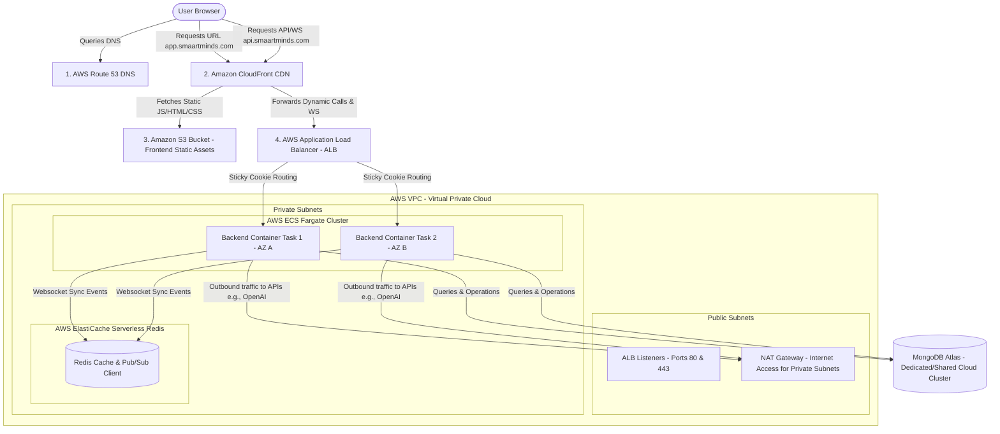

# Production AWS Guide: Serverless Container Architecture (Option B - ECS Fargate)

This guide details **Option B** (AWS ECS Fargate), which is the most cost-effective, scalable, and resilient approach for the **SMAART Minds** application. It eliminates Kubernetes completely to save costs while maintaining high-availability production standards.

---

## 1. Core Concepts: Docker vs. Kubernetes in Option B

When deploying to AWS ECS Fargate, you must understand how Docker and Kubernetes fit into this architectural tier.

### A. Do we need Docker?
**YES.** You absolutely need Docker. 
*   **Why?** AWS ECS Fargate is a *serverless container runner*. It does not run raw JavaScript or Node.js files directly. Instead, it runs **Docker images**. 
*   **How it works:** You write a `Dockerfile` for your backend. A CI/CD tool (GitHub Actions) builds this into a Docker container image and pushes it to **Amazon ECR** (Elastic Container Registry). Fargate then downloads and runs this container image.

### B. Do we need Kubernetes?
**NO.** You do **NOT** need Kubernetes.
*   **Why?** Kubernetes (AWS EKS) is a container orchestrator. **AWS ECS (Elastic Container Service)** is also a container orchestrator. They are direct competitors. By choosing Option B (ECS), we swap Kubernetes for AWS ECS, which is much simpler and cheaper.

### C. Why is Kubernetes (EKS) so expensive, and why is ECS Fargate better for us?
1.  **Cluster Fee:** AWS charges a flat rate of **$73.00/month (~₹6,100)** just to keep the Kubernetes control plane running, even if you deploy zero containers. ECS has **zero base fees**.
2.  **Server Management:** With standard Kubernetes, you pay for virtual servers (EC2 instances) 24/7, even if your app is idle. With ECS Fargate, you only pay for the exact vCPU and RAM your containers consume per second.
3.  **Complexity Overhead:** Kubernetes requires configuring Ingress Controllers, CoreDNS, pod network interfaces, and writing thousands of lines of YAML. ECS Fargate integrates directly with native AWS resources (ALB, IAM, CloudWatch) out of the box.

---

## 2. Option B Production Architecture Flow Diagram

Below is the complete architectural flow showing how frontend traffic, backend APIs, WebSockets, database calls, and synchronization events interact.



---

## 3. End-to-End Component Breakdown & Data Paths

### A. Routing and CDN Layer (Route 53, S3, CloudFront)
1.  **DNS Lookup (`Route 53`):** When a user enters `app.smaartminds.com`, Route 53 points the browser to the nearest CloudFront edge location.
2.  **Frontend Delivery (`S3` + `CloudFront`):** CloudFront serves static React files directly from the S3 bucket. If the page is cached at the edge server, the load on S3 is 0%, ensuring rapid page rendering.
3.  **API/WebSocket Routing:** API requests (`/api/*`) and Socket.io endpoints (`/socket.io/*`) go through CloudFront but are forwarded directly to the **Application Load Balancer (ALB)** at `api.smaartminds.com`.

### B. Application Load Balancer (ALB)
*   **Traffic Inspector:** ALB receives requests on port `443` (encrypted via SSL from AWS Certificate Manager) and forwards them to backend tasks on port `5000`.
*   **Cookie Stickiness:** When a user initiates a Socket.io session, the ALB attaches a cookie (`AWSALB`). Subsequent WebSocket polling and upgrade requests are routed to the **same backend container**, preventing connection handshaking failures.

### C. Serverless Containers (AWS ECS Fargate)
*   **Multi-AZ Redundancy:** ECS deploys at least two backend container tasks across separate AWS Availability Zones (AZ A and AZ B). If AZ A goes down due to an AWS outage, AZ B takes over immediately without a crash.
*   **Private Security:** The containers are deployed in **Private Subnets**. They have no public IP addresses and cannot be accessed directly from the public internet, protecting them from hackers. Outbound traffic (like OpenAI API requests) goes through a **NAT Gateway**.

### D. WebSocket Synchronizer (ElastiCache Serverless Redis)
*   If User A is connected to `Container Task 1` and User B is connected to `Container Task 2`, they cannot talk to each other because their WebSocket connections live in separate server memories.
*   **The Solution:** Both containers connect to a single **ElastiCache Redis** instance. When User A sends an event, `Task 1` publishes it to Redis. Redis broadcasts it to `Task 2`, which emits it to User B. This keeps the chat, notifications, and updates perfectly synchronized.

### E. Database Layer (MongoDB Atlas)
*   Your backend containers read and write data to MongoDB Atlas. We configure **IP Whitelisting** in MongoDB Atlas to accept connections only from the NAT Gateway IP of your AWS VPC, securing your application database.

---

## 4. Step-by-Step Implementation Guide for Option B

### Step 1: Create a Backend Dockerfile
Create `Dockerfile` in the `/back-end` directory:

```dockerfile
FROM node:20-alpine AS builder
WORKDIR /usr/src/app
COPY package*.json ./
RUN npm ci --only=production
COPY . .

FROM node:20-alpine
WORKDIR /usr/src/app
COPY --from=builder /usr/src/app ./
RUN chown -R node:node /usr/src/app
USER node
EXPOSE 5000
ENV NODE_ENV=production
# Node memory tuning to match Fargate task size (512MB RAM)
CMD ["node", "--max-old-space-size=450", "server.js"]
```

### Step 2: Configure Redis in the Backend (`server.js`)
Install the dependencies: `npm install redis @socket.io/redis-adapter`
Modify `server.js` to connect to the Redis instance using environment variables:

```javascript
const { createClient } = require('redis');
const { createAdapter } = require('@socket.io/redis-adapter');

const io = require('socket.io')(httpServer, {
  cors: {
    origin: process.env.FRONTEND_URL || "https://app.smaartminds.com",
    credentials: true
  }
});

if (process.env.REDIS_HOST) {
  const redisUrl = `redis://${process.env.REDIS_HOST}:${process.env.REDIS_PORT || 6379}`;
  const pubClient = createClient({ url: redisUrl });
  const subClient = pubClient.duplicate();

  Promise.all([pubClient.connect(), subClient.connect()]).then(() => {
    io.adapter(createAdapter(pubClient, subClient));
    console.log("Scaled WebSockets successfully using ElastiCache Redis Adapter.");
  }).catch(err => {
    console.error("Redis scaling failed. Operating in single-node mode.", err);
  });
}
```

### Step 3: Set up AWS ECS Fargate Infrastructure
1.  **ECR Registry:** Go to AWS console -> **ECR** -> Create Repository named `smaart-backend`.
2.  **ElastiCache Redis:** Go to AWS console -> **ElastiCache** -> Create Redis Cache -> Select **Serverless** (scale-to-zero, cheap for startup usage). Copy the Endpoint Address.
3.  **Application Load Balancer (ALB):**
    *   Create an ALB in your VPC public subnets.
    *   Create a Target Group on port 5000.
    *   Under Target Group Attributes, turn on **Stickiness** -> Type: **Load balancer cookie**.
4.  **ECS Cluster:**
    *   Go to **ECS** -> Create Cluster -> Name: `smaart-production-cluster`.
5.  **Task Definition:**
    *   Create a Task Definition with launch type **FARGATE**.
    *   Allocate **0.25 vCPU** and **512 MB Memory** (highly efficient, costs only ~$7/month per task).
    *   Add your container image URL (from your ECR repository).
    *   Map Container Port `5000` to host port `5000`.
    *   Input Environment Variables (MongoDB connection URI, JWT secrets, Cloudinary keys, `REDIS_HOST` URL).
6.  **Create Service:**
    *   Run Fargate Task Definition as a Service under your cluster.
    *   Set **Desired Tasks: 2** (for high availability).
    *   Attach the service to your Application Load Balancer.

---

## 5. CI/CD Pipeline for Option B (GitHub Actions)

This pipeline builds your Docker image, pushes it to ECR, and deploys it to your ECS Fargate Cluster automatically on every push to the `main` branch.

Create `.github/workflows/deploy.yml` in your repository:

```yaml
name: SMAART Minds Option B ECS Deploy

on:
  push:
    branches:
      - main

permissions:
  id-token: write
  contents: read

env:
  AWS_REGION: ap-south-1
  ECR_REPOSITORY: smaart-backend
  ECS_SERVICE: smaart-backend-service
  ECS_CLUSTER: smaart-production-cluster
  ECS_TASK_DEFINITION: .aws/task-definition.json # Maintain your task definition json in git
  CONTAINER_NAME: backend

jobs:
  deploy:
    runs-on: ubuntu-latest
    steps:
      - name: Checkout Code
        uses: actions/checkout@v4

      - name: Configure AWS Credentials
        uses: aws-actions/configure-aws-credentials@v4
        with:
          role-to-assume: arn:aws:iam::123456789012:role/GithubActionsECSRole
          aws-region: ${{ env.AWS_REGION }}

      - name: Login to Amazon ECR
        id: login-ecr
        uses: aws-actions/amazon-ecr-login@v2

      - name: Build, tag, and push Backend Image
        id: build-image
        env:
          ECR_REGISTRY: ${{ steps.login-ecr.outputs.registry }}
          IMAGE_TAG: ${{ github.sha }}
        run: |
          docker build -t $ECR_REGISTRY/$ECR_REPOSITORY:$IMAGE_TAG -t $ECR_REGISTRY/$ECR_REPOSITORY:latest ./back-end
          docker push $ECR_REGISTRY/$ECR_REPOSITORY:$IMAGE_TAG
          docker push $ECR_REGISTRY/$ECR_REPOSITORY:latest
          echo "image=$ECR_REGISTRY/$ECR_REPOSITORY:$IMAGE_TAG" >> $GITHUB_OUTPUT

      - name: Fill in the new image ID in the Amazon ECS task definition
        id: task-def
        uses: aws-actions/amazon-ecs-render-task-definition@v1
        with:
          task-definition: ${{ env.ECS_TASK_DEFINITION }}
          container-name: ${{ env.CONTAINER_NAME }}
          image: ${{ steps.build-image.outputs.image }}

      - name: Deploy Amazon ECS task definition
        uses: aws-actions/amazon-ecs-deploy-task-definition@v2
        with:
          task-definition: ${{ steps.task-def.outputs.task-definition }}
          service: ${{ env.ECS_SERVICE }}
          cluster: ${{ env.ECS_CLUSTER }}
          wait-for-service-stability: true

      - name: Build Frontend & Deploy to S3
        run: |
          cd front-end
          npm ci
          echo "VITE_API_URL=https://api.smaartminds.com" > .env.production
          npm run build
          aws s3 sync dist/ s3://app.smaartminds.com --delete

      - name: Invalidate CloudFront CDN Cache
        run: |
          aws cloudfront create-invalidation --distribution-id E123456789ABCD --paths "/*"
```

---

## 6. Complete Cost Breakdown in INR (Option B)

Here is your exact monthly running cost breakdown for this Serverless container structure.

| Service | Component Specifications | Monthly Cost (USD) | Monthly Cost (INR) |
| :--- | :--- | :--- | :--- |
| **AWS ECS Fargate** | 2 Tasks (0.25 vCPU, 512MB RAM each) running 24/7 | $14.50 | ~₹1,210 |
| **AWS ALB** | 1 Application Load Balancer (Routing & Stickiness) | $22.50 | ~₹1,880 |
| **ElastiCache Redis** | Serverless Option (Charges based on storage/requests) | $7.00 | ~₹580 |
| **S3 & CloudFront** | Hosting React App + CDN cached egress | $5.00 | ~₹420 |
| **MongoDB Atlas** | Shared Cluster (M2/M5 Tier with scaling backup) | $15.00 | ~₹1,250 |
| **NAT Gateways** | 1 NAT Gateway for secure outbound container calls | $32.00 | ~₹2,670 |
| **DNS (Route 53 & ACM)**| Hosted Domain Zone + SSL Certificate queries | $0.50 | ~₹40 |
| **Total Estimated Cost** | **Option B Serverless Cluster** | **$96.50** | **~₹8,050 / month** |

*Note: You can optimize this cost down to **~₹5,380/month** by using AWS VPC NAT Instance configuration instead of a managed NAT Gateway (which saves ~₹2,670/month).*
