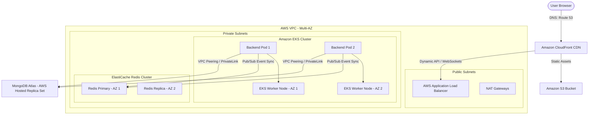

# Enterprise-Grade AWS Production Deployment Guide for SMAART Minds

This guide provides a comprehensive, production-grade architecture and step-by-step instructions to deploy the SMAART Minds MERN stack application (React frontend, Node.js/Express backend with WebSockets, MongoDB, and Redis) on Amazon Web Services (AWS) using industry standard practices (Docker, Kubernetes, CI/CD, Route 53, and CloudFront).

---

## 1. High-Availability Production Architecture

To ensure 99.99% uptime, prevent crashes, and scale seamlessly under load, the production architecture is distributed across multiple **AWS Availability Zones (Multi-AZ)** within a secure Virtual Private Cloud (VPC).



### Key Architectural Decisions:
1. **Frontend Hosting (S3 + CloudFront)**: React/Vite is compiled into static files (`HTML/JS/CSS`). Hosting these on S3 and caching them on CloudFront CDN is the standard best practice. It is virtually immune to crashes, handles infinite traffic, and decreases latency globally.
2. **Backend Orchestration (Amazon EKS / Kubernetes)**: Containers are managed by Kubernetes (EKS) in private subnets. Node.js processes are stateless, and replica counts dynamically scale up/down based on CPU/Memory usage.
3. **Sticky Session Load Balancer (ALB)**: The Application Load Balancer routes traffic to EKS backend pods. Because `socket.io` uses HTTP long-polling before upgrading to WebSockets, the ALB is configured with **cookie-based sticky sessions**.
4. **WebSocket Synchronization (Redis)**: When scaling to multiple pods, a user connected to `Pod A` cannot communicate directly with a user on `Pod B`. We use **AWS ElastiCache Redis** as a pub/sub broker to synchronize WebSocket events across all pods.
5. **Database (MongoDB Atlas on AWS)**: Hosted as a 3-node replica set in the same AWS region, secured using VPC Peering or AWS PrivateLink so database traffic never travels over the public internet.

---

## 2. Infrastructure Setup & Network Design

### A. AWS VPC Setup
A secure network isolation is mandatory. Setup a custom VPC:
*   **VPC CIDR**: `10.0.0.0/16`
*   **Public Subnets** (2x, different AZs): For the Application Load Balancer and NAT Gateways.
*   **Private Subnets** (2x, different AZs): For EKS Worker Nodes and ElastiCache Redis. EKS pods access the internet via NAT Gateways.
*   **VPC Endpoints**: Enable private endpoints for S3, ECR, and CloudWatch to keep internal AWS traffic off the public internet.

### B. DNS & SSL Routing (Route 53 + ACM)
1.  **Domain Mapping**: Map your domain (e.g., `smaartminds.com`) in **AWS Route 53** by creating a hosted zone.
2.  **SSL Certificates**: Request a wildcard SSL certificate (`*.smaartminds.com`) in **AWS ACM (Certificate Manager)**.
    *   *Note: CloudFront requires ACM certificates to be created in the `us-east-1` (N. Virginia) region.*
    *   *ALB certificates should be created in the application's local deployment region (e.g., `ap-south-1` Mumbai).*
3.  **DNS Records**:
    *   `app.smaartminds.com` -> Alias to **CloudFront Distribution** (Frontend).
    *   `api.smaartminds.com` -> Alias to **AWS ALB DNS Name** (Backend).

---

## 3. Dockerization

To run the application in Kubernetes, both frontend and backend must be packaged as Docker container images.

### A. Backend Dockerfile (`/back-end/Dockerfile`)
Create this file in your `/back-end` directory. It uses a multi-stage build to minimize container size and enhance security.

```dockerfile
# Stage 1: Build & Dependencies
FROM node:20-alpine AS builder
WORKDIR /usr/src/app

# Install build dependencies (if any native npm packages need compilation)
RUN apk add --no-cache python3 make g++

# Cache dependencies
COPY package*.json ./
RUN npm ci --only=production

# Copy application source
COPY . .

# Stage 2: Runtime Environment
FROM node:20-alpine
WORKDIR /usr/src/app

# Copy production node_modules and code from builder
COPY --from=builder /usr/src/app ./

# Create a non-privileged user for security
RUN chown -R node:node /usr/src/app
USER node

# Expose production backend port
EXPOSE 5000

ENV NODE_ENV=production

# Health check to let Kubernetes monitor container status
HEALTHCHECK --interval=30s --timeout=5s --start-period=10s --retries=3 \
  CMD node -e "require('http').get('http://localhost:5000/health', (r) => r.statusCode === 200 ? process.exit(0) : process.exit(1))"

CMD ["node", "server.js"]
```

### B. Frontend Dockerfile (`/front-end/Dockerfile` - Optional Alternative)
*Only use this if you decide to run the React App inside EKS instead of S3+CloudFront (S3+CloudFront is highly recommended instead).*

```dockerfile
# Stage 1: Build React static assets
FROM node:20-alpine AS builder
WORKDIR /usr/src/app
COPY package*.json ./
RUN npm ci
COPY . .
# Run production build
RUN npm run build

# Stage 2: Serve using Nginx
FROM nginx:1.25-alpine
COPY --from=builder /usr/src/app/dist /usr/share/nginx/html
# Custom nginx config to handle React Router routing (redirecting all routes to index.html)
COPY nginx.conf /etc/nginx/conf.d/default.conf
EXPOSE 80
CMD ["nginx", "-g", "daemon off;"]
```

*Frontend `nginx.conf` requirement:*
```nginx
server {
    listen 80;
    location / {
        root /usr/share/nginx/html;
        index index.html index.htm;
        try_files $uri $uri/ /index.html;
    }
}
```

---

## 4. Redis WebSocket Synchronization

When your backend scales to multiple Pods, a user connected to Pod #1 cannot emit an event to a user connected to Pod #2. To fix this, you must integrate the Redis Adapter.

### Code Modification (`/back-end/server.js`)
Install the required packages in the backend:
`npm install redis @socket.io/redis-adapter`

Update your Socket.io initialization code in `server.js`:

```javascript
const { createClient } = require('redis');
const { createAdapter } = require('@socket.io/redis-adapter');

const io = require('socket.io')(httpServer, {
  cors: {
    origin: process.env.FRONTEND_URL || "https://app.smaartminds.com",
    methods: ["GET", "POST"],
    credentials: true
  }
});

// Configure Redis adapter for horizontal scaling (WebSockets Multi-Pod sync)
if (process.env.REDIS_HOST) {
  const pubClient = createClient({ 
    url: `redis://${process.env.REDIS_USERNAME || ''}:${process.env.REDIS_PASSWORD || ''}@${process.env.REDIS_HOST}:${process.env.REDIS_PORT || 6379}` 
  });
  const subClient = pubClient.duplicate();

  pubClient.on('error', (err) => console.error('Redis Pub Client Error', err));
  subClient.on('error', (err) => console.error('Redis Sub Client Error', err));

  Promise.all([pubClient.connect(), subClient.connect()]).then(() => {
    io.adapter(createAdapter(pubClient, subClient));
    console.log("WebSocket Redis Adapter connected and scaling enabled.");
  }).catch(err => {
    console.error("Redis connection failed. WebSockets running in single-instance mode.", err);
  });
}
```

---

## 5. Kubernetes Configuration (Amazon EKS)

Create a directory named `/k8s` in your project root. These files define how the backend runs on Amazon EKS.

### A. Deployment Manifest (`/k8s/backend-deployment.yaml`)
This controls the replication and rolling updates (Zero Downtime) of the backend containers.

```yaml
apiVersion: apps/v1
kind: Deployment
metadata:
  name: smaart-backend
  namespace: production
  labels:
    app: smaart-backend
spec:
  replicas: 2 # Maintain at least 2 instances across different Availability Zones
  strategy:
    type: RollingUpdate
    rollingUpdate:
      maxSurge: 1
      maxUnavailable: 0 # Ensure no downtime during updates
  selector:
    matchLabels:
      app: smaart-backend
  template:
    metadata:
      labels:
        app: smaart-backend
    spec:
      containers:
      - name: backend
        image: <AWS_ACCOUNT_ID>.dkr.ecr.<REGION>.amazonaws.com/smaart-backend:latest
        imagePullPolicy: Always
        ports:
        - containerPort: 5000
        resources:
          requests:
            memory: "512Mi"
            cpu: "250m"
          limits:
            memory: "1024Mi"
            cpu: "500m"
        envFrom:
        - secretRef:
            name: backend-secrets # Externalizes sensitive variables (DB URIs, Keys)
        readinessProbe:
          httpGet:
            path: /health
            port: 5000
          initialDelaySeconds: 15
          periodSeconds: 10
        livenessProbe:
          httpGet:
            path: /health
            port: 5000
          initialDelaySeconds: 20
          periodSeconds: 20
```

### B. Service & Ingress with WebSocket Stickiness (`/k8s/backend-ingress.yaml`)
To support WebSockets, configure AWS Application Load Balancer Ingress to enforce cookie stickiness.

```yaml
apiVersion: v1
kind: Service
metadata:
  name: smaart-backend-service
  namespace: production
spec:
  selector:
    app: smaart-backend
  ports:
  - protocol: TCP
    port: 80
    targetPort: 5000
  type: NodePort
---
apiVersion: networking.k8s.io/v1
kind: Ingress
metadata:
  name: smaart-backend-ingress
  namespace: production
  annotations:
    kubernetes.io/ingress.class: alb
    alb.ingress.kubernetes.io/scheme: internet-facing
    alb.ingress.kubernetes.io/target-type: ip
    alb.ingress.kubernetes.io/listen-ports: '[{"HTTP": 80}, {"HTTPS":443}]'
    alb.ingress.kubernetes.io/certificate-arn: arn:aws:acm:ap-south-1:123456789012:certificate/abc-123-def # Replace with your ACM certificate ARN
    alb.ingress.kubernetes.io/ssl-redirect: '443'
    # STICKY SESSIONS FOR WEBSOCKETS (SOCKET.IO)
    alb.ingress.kubernetes.io/target-group-attributes: stickiness.enabled=true,stickiness.type=lb_cookie,stickiness.lb_cookie.duration_seconds=3600
spec:
  rules:
  - host: api.smaartminds.com
    http:
      paths:
      - path: /
        pathType: Prefix
        backend:
          service:
            name: smaart-backend-service
            port:
              number: 80
```

### C. Autoscaling (`/k8s/backend-hpa.yaml`)
Automatically scale up pods if CPU utilization exceeds 70%.

```yaml
apiVersion: autoscaling/v2
kind: HorizontalPodAutoscaler
metadata:
  name: smaart-backend-hpa
  namespace: production
spec:
  scaleTargetRef:
    apiVersion: apps/v1
    kind: Deployment
    name: smaart-backend
  minReplicas: 2
  maxReplicas: 10
  metrics:
  - type: Resource
    resource:
      name: cpu
      target:
        type: Utilization
        averageUtilization: 70
```

---

## 6. CI/CD Pipeline (GitHub Actions)

This pipeline automates building the code, scanning, uploading containers to AWS ECR, and deploying to EKS when pushing to the `main` branch.

Create the file `.github/workflows/deploy.yml` in your repository:

```yaml
name: SMAART Minds Production CI/CD

on:
  push:
    branches:
      - main

permissions:
  id-token: write
  contents: read

env:
  AWS_REGION: ap-south-1 # Change to your AWS Region
  ECR_REPOSITORY: smaart-backend
  EKS_CLUSTER_NAME: smaart-production-cluster

jobs:
  # Job 1: Test & Quality Checks
  test:
    runs-on: ubuntu-latest
    steps:
      - name: Checkout Code
        uses: actions/checkout@v4

      - name: Setup Node.js
        uses: actions/workspaces/setup-node@v4
        with:
          node-version: 20
          cache: 'npm'
          cache-dependency-path: './back-end/package-lock.json'

      - name: Install Backend Deps
        run: |
          cd back-end
          npm ci

      # Add testing steps here once unit tests are written
      # - name: Run Backend Tests
      #   run: |
        #     cd back-end
        #     npm test

  # Job 2: Build, Push, and Deploy
  build-and-deploy:
    needs: test
    runs-on: ubuntu-latest
    steps:
      - name: Checkout Code
        uses: actions/checkout@v4

      # Configure AWS credentials securely using OpenID Connect (OIDC)
      - name: Configure AWS Credentials
        uses: aws-actions/configure-aws-credentials@v4
        with:
          role-to-assume: arn:aws:iam::123456789012:role/GithubActionsEKSRole # Replace with your IAM Role ARN
          aws-region: ${{ env.AWS_REGION }}

      - name: Login to Amazon ECR
        id: login-ecr
        uses: aws-actions/amazon-ecr-login@v2

      # Backend Docker Build & Push
      - name: Build, tag, and push Backend Image to Amazon ECR
        env:
          ECR_REGISTRY: ${{ steps.login-ecr.outputs.registry }}
          IMAGE_TAG: ${{ github.sha }}
        run: |
          docker build -t $ECR_REGISTRY/$ECR_REPOSITORY:$IMAGE_TAG -t $ECR_REGISTRY/$ECR_REPOSITORY:latest ./back-end
          docker push $ECR_REGISTRY/$ECR_REPOSITORY:$IMAGE_TAG
          docker push $ECR_REGISTRY/$ECR_REPOSITORY:latest

      # Setup kubectl to interact with EKS
      - name: Update Kubeconfig
        run: |
          aws eks update-kubeconfig --name ${{ env.EKS_CLUSTER_NAME }} --region ${{ env.AWS_REGION }}

      # Deploy Manifests to EKS
      - name: Deploy to Amazon EKS
        run: |
          kubectl apply -f k8s/
          # Dynamically update the deployment image to trigger a rolling update
          kubectl set image deployment/smaart-backend backend=${{ steps.login-ecr.outputs.registry }}/${{ env.ECR_REPOSITORY }}:${{ github.sha }} -n production
          # Block build until rollout finishes successfully
          kubectl rollout status deployment/smaart-backend -n production

      # Frontend Build & Deploy to S3
      - name: Build Frontend & Deploy
        run: |
          cd front-end
          npm ci
          # Set backend URL to the production domain API during build
          echo "VITE_API_URL=https://api.smaartminds.com" > .env.production
          npm run build
          # Sync output to S3 Bucket
          aws s3 sync dist/ s3://app.smaartminds.com --delete

      # Invalidate CloudFront CDN cache to deploy updates instantly
      - name: Invalidate CloudFront CDN
        run: |
          aws cloudfront create-invalidation --distribution-id E123456789ABCD --paths "/*" # Replace with your CloudFront distribution ID
```

---

## 7. Database Production Setup (MongoDB Atlas)

For MongoDB, running databases inside Kubernetes is not recommended due to storage state management complexities. Instead, use a managed service like **MongoDB Atlas** running on AWS.

1.  **Deployment Type**: Provision a **Dedicated M10** cluster (highly available 3-node replica set with auto-scaling storage, automated backups, and 99.9% SLA).
2.  **VPC Peering**:
    *   Navigate to MongoDB Atlas -> Network Access -> Peering.
    *   Click **Add Peering Connection** -> Select AWS.
    *   Input your AWS Account ID, VPC ID, and AWS Region.
    *   Accept the connection in your AWS VPC Console under "Peering Connections".
3.  **Security**:
    *   Whitelist the CIDR block of your AWS VPC private subnets (`10.0.0.0/16`) in MongoDB Atlas.
    *   Disable external public internet access completely (`0.0.0.0/0`) to block unauthorized connection attempts.

---

## 8. Detailed Production Cost Breakdown (INR)

AWS and MongoDB billing varies dynamically based on exchange rates and actual query/traffic volume. Below is a detailed breakdown based on **1 USD = ₹83.50 INR**.

### Option A: Standard Production Setup (Using Amazon EKS - Recommended for Large Projects)
*Use this option if you require dedicated Kubernetes cluster controls, advanced pod networking, and scaling options.*

| Service | AWS Resource Details | Monthly Cost (USD) | Monthly Cost (INR) |
| :--- | :--- | :--- | :--- |
| **Amazon EKS Control Plane** | Cluster Management Fee (1 Cluster) | $73.00 | ~₹6,100 |
| **EKS Worker Nodes** | 2x `t3.medium` instances (4GB RAM, 2 vCPUs) | $61.32 | ~₹5,120 |
| **NAT Gateways** | 1 NAT Gateway + Data Processed | $32.00 | ~₹2,670 |
| **AWS Application Load Balancer** | 1 ALB for routing & sticky sessions | $22.50 | ~₹1,880 |
| **AWS ElastiCache Redis** | `cache.t3.medium` instance (Replication Enabled) | $34.00 | ~₹2,840 |
| **AWS CloudFront & S3** | Static website hosting (CDN egress 200GB) | $18.00 | ~₹1,500 |
| **MongoDB Atlas** | Dedicated M10 Tier (AWS Multi-AZ) | $57.00 | ~₹4,760 |
| **AWS Route 53 & Secrets** | Hosted zone, queries, SSL certificates (ACM) | $5.00 | ~₹420 |
| **Total Estimated Cost** | **Enterprise/Standard Production** | **~$302.82** | **~₹25,290 / month** |

### Option B: Cost-Optimized Production Setup (Using AWS ECS Fargate - Highly Recommended for Startups)
*EKS has a flat ₹6,100 monthly base fee just to keep the cluster manager alive. For startups, we recommend **AWS ECS Fargate (Elastic Container Service)**. Fargate is serverless, charges only for running container capacity, and does not have a cluster base fee.*

| Service | AWS Resource Details | Monthly Cost (USD) | Monthly Cost (INR) |
| :--- | :--- | :--- | :--- |
| **AWS ECS Fargate** | 2 Tasks (0.5 vCPU, 1GB RAM each) | $18.00 | ~₹1,500 |
| **AWS Application Load Balancer** | 1 ALB for routing | $22.50 | ~₹1,880 |
| **AWS ElastiCache Serverless** | Serverless Redis (Low usage) | $7.00 | ~₹580 |
| **AWS CloudFront & S3** | Static website hosting (Frontend) | $5.00 | ~₹420 |
| **MongoDB Atlas** | Shared M2/M5 Tier (Upgrade to M10 later) | $9.00 - $19.00 | ~₹750 - ₹1,590 |
| **NAT Gateways & Misc** | Reduced NAT Gateway and DNS costs | $15.00 | ~₹1,250 |
| **Total Estimated Cost** | **Cost-Optimized Production** | **~$76.50 - $86.50** | **~₹6,390 - ₹7,220 / month** |

---

## 9. Failure Prevention & "Anti-Crash" Checklist

To ensure your application **never crashes**, implement the following configurations:

1.  **Memory Limit Configurations (Prevent Out-Of-Memory Crashes)**:
    *   Node.js by default does not respect Docker container memory limits. Explicitly configure your node container start command to limit V8 garbage collection:
        `node --max-old-space-size=450 server.js` (for a 512MB RAM container).
2.  **Graceful Shutdown**:
    *   Handle shutdown signals (`SIGTERM`, `SIGINT`) in `server.js` to close database connections and wait for pending WebSocket messages to finish before terminating.
    ```javascript
    process.on('SIGTERM', () => {
      console.log('SIGTERM signal received. Closing HTTP server gracefully...');
      httpServer.close(() => {
        mongoose.connection.close(false, () => {
          console.log('MongoDB connection closed. Process exiting.');
          process.exit(0);
        });
      });
    });
    ```
3.  **Database Connection Pool Management**:
    *   Configure mongoose pool size limits in database connections to prevent running out of sockets:
        `mongoose.connect(uri, { maxPoolSize: 50 });`
4.  **Rate Limiting & DDOS Protection**:
    *   Use `express-rate-limit` in the backend API to block brute-force attacks.
    *   Enable **AWS Shield Standard** (Free) and configure **AWS WAF** (Web Application Firewall) on your Application Load Balancer to filter malicious payloads.
5.  **Alerting & Observability**:
    *   Setup **AWS Budget Alerts** to receive email notifications when projected monthly costs exceed your predefined limits (e.g. ₹5,000).
    *   Configure **AWS CloudWatch Container Insights** to alert you when backend pod CPU usage exceeds 85% for more than 5 minutes.
