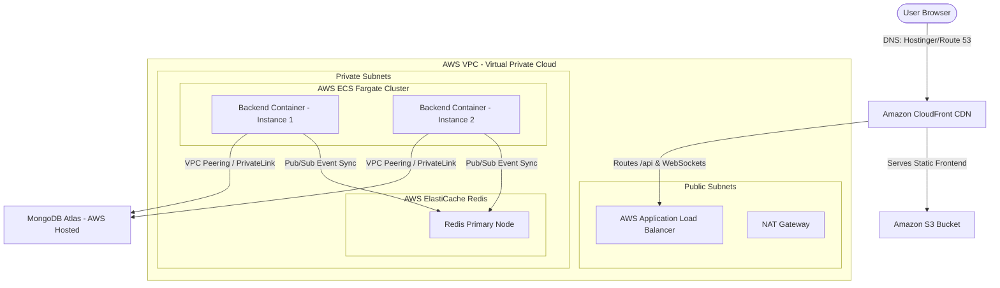

# End-to-End AWS, Docker, DNS, & Hostinger Deployment Guide

This comprehensive guide is designed for the **SMAART Minds** engineering team. It explains the entire deployment workflow—from local code and Docker containers to AWS production cloud hosting and custom domain DNS configuration using Hostinger.

---

## 1. High-Level Architecture Overview

SMAART Minds uses a modern **MERN stack** (MongoDB, Express, React, Node.js) with real-time **Socket.io WebSockets**. In a professional production environment, we decouple the frontend (static assets) from the backend (dynamic APIs and WebSocket processes) to ensure high availability, security, cost optimization, and instant loading speeds.



### Core Architecture Components

1. **Frontend Hosting (S3 + CloudFront):** 
   * **Amazon S3** stores the built React app (HTML, CSS, JS, images).
   * **Amazon CloudFront** is a Content Delivery Network (CDN) that caches frontend assets at global "edge locations" close to users.
   * *Why?* This eliminates server load for static files, costs virtually nothing (~$0.50/mo), and ensures the frontend never crashes.
2. **Backend Orchestration (AWS ECS Fargate + Docker):** 
   * The Express/Node.js API is wrapped in a **Docker container** and run on **AWS ECS Fargate** (Elastic Container Service).
   * *Why Fargate?* It is serverless. You don't manage Virtual Machines (EC2); you just define how much CPU/RAM the container needs, and AWS scales, runs, and monitors it automatically.
3. **Application Load Balancer (ALB):**
   * Acts as the single entry point for backend traffic. It accepts requests at `api.smaartminds.com` and distributes them across multiple running backend containers.
   * Enforces **SSL termination** (decrypts HTTPS traffic before forwarding it to containers).
   * Implements **Sticky Sessions (Session Affinity)** via cookies, which is critical for WebSockets to maintain persistent connections to the same container.
4. **WebSocket Sync Broker (ElastiCache Serverless Redis):**
   * If traffic increases and ECS scales the backend from 1 container to 5, users will be split across different containers. A user on Container #1 cannot natively send a message to a user on Container #2.
   * **Redis** acts as a message broker using Pub/Sub. When an event is emitted, Redis broadcasts it to all containers, ensuring every user receives real-time updates regardless of which container they are connected to.
5. **Database (MongoDB Atlas):**
   * Managed MongoDB cluster hosted directly inside the AWS network. Secured via **VPC Peering** or private IP access, bypassing the public internet entirely.
6. **Domain & DNS (Hostinger & Route 53):**
   * **Hostinger** acts as the domain registrar (where you bought `yourdomain.com`).
   * **AWS Route 53** acts as the DNS hosting manager, directing web browsers to CloudFront (for the frontend) and the ALB (for the backend).

---

## 2. DNS & Custom Domain Setup (Hostinger Integration)

When you buy a domain (e.g., `smaartminds.com`) on **Hostinger**, you must route users who type that domain into their browsers to your AWS resources. You have two implementation choices.

### Option A: Delegate DNS Management to AWS Route 53 (Recommended)
This approach moves all DNS records to AWS. It is faster, more secure, and allows Route 53 to automatically map subdomains to CloudFront and ALBs using high-performance "Alias" records.

```
┌──────────────────┐      NS Delegation      ┌────────────────────┐
│ Hostinger        │ ──────────────────────> │ AWS Route 53       │
│ Domain Registrar │                         │ DNS Zone Manager   │
└──────────────────┘                         └────────────────────┘
                                               │             │
                    app.yourdomain.com ────────┘             └────── api.yourdomain.com
                               │                                           │
                               ▼                                           ▼
                     [CloudFront Distribution]                     [Application Load Balancer]
```

#### Step-by-Step Configuration:
1. **Create Hosted Zone in AWS:**
   * Go to the **AWS Route 53 Console** -> **Hosted Zones** -> Click **Create Hosted Zone**.
   * Enter your domain name: `yourdomain.com`. Select **Public Hosted Zone**.
   * AWS will create the zone and generate **4 Name Server (NS) records** (e.g., `ns-123.awsdns-45.com`).
2. **Update Nameservers in Hostinger:**
   * Log in to your **Hostinger hPanel**.
   * Navigate to **Domains** -> Click **Manage** next to your domain.
   * Look for **Nameservers** in the sidebar. Click **Change Nameservers**.
   * Select **Change Nameservers** manually.
   * Replace Hostinger's default nameservers (e.g., `ns1.dns.hosting.com`) with the **4 AWS nameservers** you copied from Route 53.
   * Click **Save**. *Note: Nameserver changes can take anywhere from 1 to 24 hours to propagate globally, though it usually happens in less than an hour.*
3. **Route Traffic via Route 53:**
   * Once delegated, you add all records inside Route 53:
     * **Frontend Record:** Create an `A` record for `app.yourdomain.com`. Turn on the **Alias** switch, select **Alias to CloudFront distribution**, and choose your CloudFront URL.
     * **Backend Record:** Create an `A` record for `api.yourdomain.com`. Turn on the **Alias** switch, select **Alias to Application Load Balancer**, select your region, and choose your ALB DNS name.

---

### Option B: Keep DNS on Hostinger and Point to AWS
Use this option if you have email hosting or other subdomains already running on Hostinger and don't want to migrate nameservers.

#### Step-by-Step Configuration:
1. Log in to your **Hostinger hPanel** -> **Domains** -> **Manage** -> **DNS / Nameservers**.
2. **Point Frontend to CloudFront (CNAME Record):**
   * Under **Manage DNS records**, create a new record:
     * **Type:** `CNAME`
     * **Name:** `app` *(This creates app.yourdomain.com)*
     * **Target:** `your-cloudfront-id.cloudfront.net` *(Copy this from your AWS CloudFront distribution console)*
     * **TTL:** `14400` (or default)
3. **Point Backend to AWS Load Balancer (CNAME Record):**
   * Under **Manage DNS records**, create another record:
     * **Type:** `CNAME`
     * **Name:** `api` *(This creates api.yourdomain.com)*
     * **Target:** `smaart-alb-123456789.ap-south-1.elb.amazonaws.com` *(Copy this from your AWS EC2/ALB Console)*
     * **TTL:** `14400`
4. *Important: You must create and validate SSL certificates in AWS ACM using DNS validation (CNAME records provided by AWS ACM must be added inside Hostinger's DNS Zone Editor).*

---

## 3. Dockerization: Packaging the Application

To ensure our application runs exactly the same way in AWS as it does on our local development machines, we package the code using **Docker**.

### The Multi-Stage Backend Dockerfile (`/back-end/Dockerfile`)
We use a **multi-stage build**. Stage 1 installs compile-time dependencies, and Stage 2 copies only the production dependencies and code into a minimal Alpine Node image. This reduces image size from ~1GB to under ~150MB, speeding up deployments and shrinking the attack surface for security vulnerabilities.

```dockerfile
# ==========================================
# STAGE 1: Build & Dependencies
# ==========================================
FROM node:20-alpine AS builder
WORKDIR /usr/src/app

# Install system utilities needed for compile-time npm modules
RUN apk add --no-cache python3 make g++

# Copy package descriptors and fetch dependencies
COPY package*.json ./
RUN npm ci --only=production

# Copy the rest of the application source code
COPY . .

# ==========================================
# STAGE 2: Lightweight Runtime Environment
# ==========================================
FROM node:20-alpine
WORKDIR /usr/src/app

# Copy production node_modules and code from Builder Stage
COPY --from=builder /usr/src/app ./

# Security Best Practice: Run container as a non-root user
RUN chown -R node:node /usr/src/app
USER node

# Expose port used by Express backend
EXPOSE 5000

ENV NODE_ENV=production

# Let AWS monitor container health directly
HEALTHCHECK --interval=30s --timeout=5s --start-period=10s --retries=3 \
  CMD node -e "require('http').get('http://localhost:5000/api/health', (r) => r.statusCode === 200 ? process.exit(0) : process.exit(1))"

# Boot the API
CMD ["node", "server.js"]
```

---

## 4. Scaling WebSockets (The Redis Adapter)

WebSockets establish a persistent TCP handshake between a user's browser and a single backend container. In a containerized multi-instance setup, this introduces a data-sync problem:

```
[User A] ───────── WebSocket ─────────> [Backend Container #1]
                                                 ? (Cannot talk directly)
[User B] ───────── WebSocket ─────────> [Backend Container #2]
```

To enable scaling, we use the **Socket.io Redis Adapter**. 

1. When User A sends an event to Container #1, Container #1 publishes it to **AWS Redis**.
2. Redis broadcasts the event to all other running containers.
3. Container #2 receives the broadcast and emits the event over the local WebSocket connection to User B.

### Node.js Code Implementation (`/back-end/server.js`)
Install the packages: `npm install redis @socket.io/redis-adapter`

```javascript
const { createClient } = require('redis');
const { createAdapter } = require('@socket.io/redis-adapter');

const io = require('socket.io')(httpServer, {
  cors: {
    origin: process.env.FRONTEND_URL || "https://app.smaartminds.com",
    methods: ["GET", "POST"],
    credentials: true
  }
});

// Configure Redis adapter for scaling WebSocket connections across multiple containers
if (process.env.REDIS_HOST) {
  const pubClient = createClient({ 
    url: `redis://${process.env.REDIS_USERNAME || ''}:${process.env.REDIS_PASSWORD || ''}@${process.env.REDIS_HOST}:${process.env.REDIS_PORT || 6379}` 
  });
  const subClient = pubClient.duplicate();

  pubClient.on('error', (err) => console.error('Redis Pub Client Connection Error:', err));
  subClient.on('error', (err) => console.error('Redis Sub Client Connection Error:', err));

  Promise.all([pubClient.connect(), subClient.connect()]).then(() => {
    io.adapter(createAdapter(pubClient, subClient));
    console.log("✅ WebSocket Redis Adapter linked. Horizontal scaling enabled!");
  }).catch(err => {
    console.error("❌ Redis connection failed. WebSockets fallback to single-instance mode.", err);
  });
}
```

---

## 5. End-to-End Step-by-Step Deployment Guide

Follow this sequence to deploy the SMAART Minds application to production on AWS.

### Phase 1: Database Setup (MongoDB Atlas)
1. Go to [MongoDB Atlas](https://www.mongodb.com/cloud/atlas/register) and create an account.
2. Provision a **Dedicated M10** cluster (Multi-AZ, automated backups, SSD storage) selecting **AWS** as the provider and choosing your primary region (e.g., `ap-south-1` Mumbai).
3. Under **Database Access**, create a user (e.g., `smaartadmin`) with a strong password.
4. Under **Network Access**:
   * Temporarily whitelist `0.0.0.0/0` to test connection, but **remove it** once VPC peering is configured.
   * Set up a **VPC Peering Connection** under the "Network Access" -> "Peering" menu. Link it to your AWS VPC ID and region. Accept the peering request in the AWS VPC Console.
   * Whitelist your AWS VPC CIDR block (e.g., `10.0.0.0/16`) in MongoDB Atlas. Now your containers can talk to the database using private, unexposed channels.

### Phase 2: Secure Network Isolation (AWS VPC Setup)
Create a custom VPC in AWS with:
* **CIDR Block:** `10.0.0.0/16`
* **2 Public Subnets:** For the ALB and NAT Gateway.
* **2 Private Subnets:** For your ECS containers and Redis instances (ensuring they have no public IPs and are isolated from the internet).
* **NAT Gateway:** Positioned in a public subnet to allow private containers to call external APIs (OpenAI, Cloudinary) without being exposed inbound.

### Phase 3: Certificate Management (AWS ACM)
1. In the AWS Console, open **ACM (Certificate Manager)**.
2. Request a public certificate for your domain: `*.yourdomain.com` (wildcard) and `yourdomain.com`.
3. Select **DNS Validation**.
4. ACM will give you a list of CNAME records. Add these records in your DNS zone editor (Route 53 or Hostinger) to verify ownership.
5. AWS will issue the SSL certificate within minutes of DNS propagation.

### Phase 4: Push Containers to AWS ECR
1. Log in to your AWS CLI on your local dev environment:
   ```bash
   aws ecr get-login-password --region ap-south-1 | docker login --username AWS --password-stdin <AWS_ACCOUNT_ID>.dkr.ecr.ap-south-1.amazonaws.com
   ```
2. Create an ECR repository for the backend:
   ```bash
   aws ecr create-repository --repository-name smaart-backend --image-scanning-configuration scanOnPush=true --encryption-configuration encryptionType=AES256
   ```
3. Build, tag, and push your Docker image:
   ```bash
   docker build -f aws-deployment/Dockerfile -t smaart-backend:latest .
   
   docker tag smaart-backend:latest <AWS_ACCOUNT_ID>.dkr.ecr.ap-south-1.amazonaws.com/smaart-backend:latest
   
   docker push <AWS_ACCOUNT_ID>.dkr.ecr.ap-south-1.amazonaws.com/smaart-backend:latest
   ```

### Phase 5: Provision ElastiCache Redis
1. Navigate to **AWS ElastiCache** -> Select **Redis caches** -> Click **Create**.
2. Select **Serverless** (zero management, scales up/down automatically).
3. Set names and select your Private Subnets. Turn on TLS (Transit Encryption).
4. Once active, copy the Redis endpoint (e.g., `smaart-redis.serverless.cache.amazonaws.com`).

### Phase 6: Save Environment Variables in AWS Secrets Manager
1. Go to **AWS Secrets Manager** -> **Store a new secret** -> Select **Other type of secret**.
2. Input all secrets from your production `.env` (like `MONGODB_URI`, `JWT_SECRET`, `REDIS_HOST`, `REDIS_PASSWORD`, `OPENAI_API_KEY`, etc.).
3. Save the secret as `production/smaart/secrets` and copy its **ARN**.

### Phase 7: Set up Application Load Balancer (ALB)
1. Go to **EC2** -> **Load Balancers** -> **Create ALB**.
2. Attach it to your **Public Subnets** and reference the ALB security group (`smaart-prod-alb-sg`).
3. Create a Target Group:
   * **Target Type:** IP
   * **Protocol:** HTTP / Port: `5000`
   * **Health Check Path:** `/api/health`
4. **Enable Sticky Sessions:** Go to the Target Group attributes, enable **Stickiness**, select **Load balancer cookie**, and set duration to `3600` (1 hour).
5. Add an HTTPS listener on port `443` in the ALB. Attach your ACM certificate, and set it to forward traffic to your Target Group.

### Phase 8: Deploy ECS Fargate Tasks & Service
1. Configure your `/aws-deployment/ecs-task-definition.json` file. Map your environment variables directly to the keys stored in your AWS Secrets Manager secret.
2. Register the task definition:
   ```bash
   aws ecs register-task-definition --cli-input-json file://aws-deployment/ecs-task-definition.json
   ```
3. Create an ECS Cluster: Name it `smaart-production-cluster`.
4. Create an ECS Service inside the cluster:
   * **Launch Type:** Fargate.
   * **Desired Tasks:** `2` (Runs two instances across separate AZs to prevent downtime if one zone experiences issues).
   * **Networking:** Choose **Private Subnets** only. Disable Public IP.
   * **Load Balancing:** Link it to the ALB target group on port `5000`.
   * **Security Group:** Attach `smaart-prod-ecs-sg` (which blocks all traffic except that coming from the ALB).

### Phase 9: Build and Deploy Frontend (S3 + CloudFront)
1. In your local `front-end` directory, create a production config pointing to the backend API:
   `VITE_API_URL=https://api.yourdomain.com`
2. Run the compiler command:
   ```bash
   npm run build
   ```
3. Go to **AWS S3 Console** -> Create a bucket `app.yourdomain.com`. Block public access.
4. Upload all compiled files from the `dist/` directory into the bucket.
5. Go to **AWS CloudFront Console** -> **Create Distribution**.
   * **Origin Domain:** Select your S3 bucket.
   * **Origin Access:** Select **Origin Access Control (OAC)** -> Create setting. (This creates a secure IAM identity allowing CloudFront to pull files from the private S3 bucket).
   * **Viewer Protocol Policy:** Redirect HTTP to HTTPS.
   * **Alternate Domain Name (CNAME):** Add `app.yourdomain.com`.
   * **Custom SSL Certificate:** Choose the ACM wildcard certificate.
   * **Default Root Object:** `index.html`.
6. Once CloudFront is created, **copy the S3 Bucket Policy** provided in the CloudFront banner, go to your S3 bucket's permissions, and paste it to authorize CloudFront read access.
7. **Fix Single Page App (SPA) Routing:** Go to CloudFront -> Distribution Settings -> **Error Pages**. Create two rules:
   * **Error Code `404`** -> Customize Response -> Path: `/index.html` -> HTTP Status: `200`.
   * **Error Code `403`** -> Customize Response -> Path: `/index.html` -> HTTP Status: `200`.
   * *Why?* This prevents React Router page refreshes from returning 404s.

---

## 6. How DNS Directs Traffic (The E2E Journey)

When a teammate or client accesses the application:

1. **Accessing the Web Portal (`app.yourdomain.com`):**
   * The browser queries DNS. Route 53 (or Hostinger) returns the **CloudFront CDN** IP address.
   * CloudFront serves static HTML, CSS, and JS files from its edge cache or pulls them from **S3**.
   * The frontend loads instantly inside the user's browser.
2. **Dynamic Operations / Logging in / WebSockets (`api.yourdomain.com`):**
   * The React code makes an API request or tries to establish a WebSocket socket connection to `api.yourdomain.com`.
   * DNS resolves this to the **AWS Application Load Balancer**.
   * The ALB intercepts the TLS handshake, decrypts the request (HTTPS -> HTTP), verifies the load balancer cookie for stickiness, and forwards it to the private **ECS Fargate Container** running on port `5000`.
   * The backend container executes logic, writes to the private **MongoDB Atlas** cluster, and publishes socket sync signals to **Redis** to keep other instances in lockstep.
