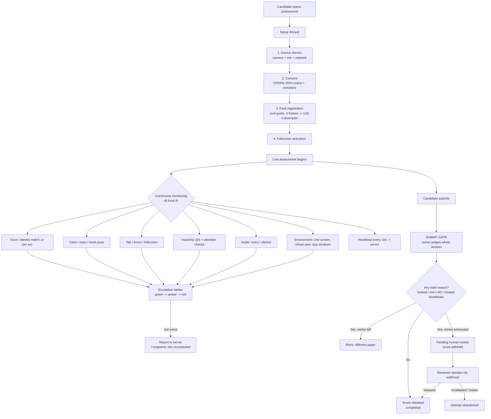
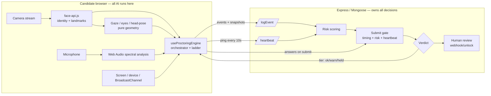
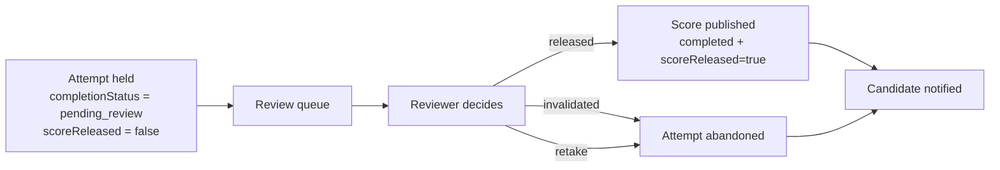

# SMAART — AI Proctoring System

**Technical & design documentation**
Complete flow · methods used · why they were chosen · honest verdict on each

*Version 1.0 · 2026-07-23*

---

## 0. TL;DR — the one-paragraph answer

SMAART proctoring is a **browser-based, AI-assisted, human-decided** system. All AI (face matching, gaze, head-pose, audio, environment) runs **locally in the candidate's browser** for privacy and cost; the browser only *reports events*, it never *decides outcomes*. **The server owns every verdict**, computed from data the candidate cannot forge (answer timing + a heartbeat gap). The system runs in **flag-only mode**: it never interrupts an honest candidate mid-exam — flags accumulate silently, the whole session is judged **once at submit**, and **every serious case goes to a human** before any score is withheld. Answers are always saved; only *publication of the score* is ever held.

**Is this the best approach? Verdict: yes, for a web-delivered assessment platform of this scale — with two caveats.** The architecture (local AI + server-authoritative decisions + human review) is the correct, defensible design and matches how serious remote-proctoring vendors work. The two caveats are (1) a browser can never be as tamper-proof as a locked-down desktop app, and (2) the **operator review UI is the main missing piece** — the back-end for human review exists, but reviewers currently have no screen to action it. Details and the full reasoning are in §12.

---

## 1. Design philosophy — the three rules everything follows

Every design decision in this system traces back to three governing rules. Read these first; the rest of the document is just their consequences.

### Rule 1 — The server owns every enforcement decision; the browser only renders the outcome.
A tampered browser can silence its own detectors, but it **cannot change a verdict**, because the two signals that matter most are computed **server-side** over data the candidate cannot forge:
- **Answer timing** — reconstructed from the timestamps of submitted answers.
- **The heartbeat gap** — the *absence* of an expected request. You cannot forge an absence.

Because the decision lives on the server, defeating the client AI only removes *soft* signals; the *hard* signals remain.

### Rule 2 — We never assert cheating.
Every user-facing string says *"we couldn't verify this attempt"*, never *"you cheated"*. Answers are **always saved**. The only thing ever withheld is **publication of the score**, and only until a human decides. This keeps the system fair, legally defensible, and humane to the honest majority who trip a detector by accident.

### Rule 3 — Flag-only mode: never interrupt a live exam.
The earlier model blocked a candidate mid-exam after 3 warnings. That punished the honest majority for a swivelling chair, and it judged *isolated seconds* instead of the *whole session* — twelve short glances away read very differently from one four-minute absence, and only an end-of-exam view can tell them apart. Now flags accumulate silently, the candidate finishes uninterrupted, and the server decides **once, at submit**.

> These rules are enforced in code by a single policy file — [`back-end/config/proctoringPolicy.js`](../back-end/config/proctoringPolicy.js) — which the live engine, the submit gate, and the analytics pass all read. The number that *flags* a session can never drift from the number that *decides* its outcome.

---

## 2. The complete flow (candidate's journey)

### Step by step

| # | Stage | What happens | Where |
|---|-------|--------------|-------|
| 1 | **Device checks** | Camera, microphone and network-latency checks. Camera is soft-gated (a denial warns but does not hard-block). | `ProctoringSetup.jsx` step 1 |
| 2 | **Consent** | DPDPA-2023 privacy notice, per-permission explanations, assessment rules, and an explicit checkbox: *"consent to face registration and identity verification."* The wizard cannot proceed without it. | `ProctoringSetup.jsx` step 2 |
| 3 | **Oval face capture** | An animated **oval face-guide overlay** (SVG mask + dashed ellipse) frames the face. Once the face is stable ~1.6s, it auto-captures **3 frames @400ms**, needs **≥2 valid**, and averages them into a single **128-float descriptor**. | `ProctoringSetup.jsx` step 3 + `faceVerificationService.registerFace` |
| 4 | **Fullscreen** | Fullscreen is activated to start the exam. | `ProctoringSetup.jsx` step 4 |
| 5 | **Live monitoring** | The engine starts: camera stream, face verification 1×/sec, gaze/eyes/head-pose, tab/focus/fullscreen listeners, inactivity timer, audio analysis, environment checks, and a 10s heartbeat. On start it logs `face_registered` (with the descriptor) so identity is provable server-side. | `useProctoringEngine.js` |
| 6 | **Escalation** | Each detected condition runs through the **green → amber → red** ladder (§7). Amber is local coaching only; red reports to the server with a snapshot, and risk is recomputed. | `proctoringLadder.js` + engine |
| 7 | **Submit** | The candidate finishes uninterrupted. On submit, the **submit gate** judges the whole session once. | `services/proctoringGate.js` |
| 8 | **Outcome** | Clean → score released. Held with retries → re-sit with a *different* paper. Held with no retries → **pending human review**, score withheld, non-accusatory "held" screen shown. | `AssessmentHeld.jsx` |
| 9 | **Human review** | A reviewer releases / invalidates / retakes via a secure webhook; the candidate is notified. | `proctoringController.webhookUnlock` |

---

## 3. Architecture — who does what

**Why this split?** Client-side AI keeps video frames on the candidate's device (privacy + zero server GPU cost + no per-frame bandwidth). Server-side decisions keep the verdict honest even if the client is tampered with. This is the standard, defensible architecture for web-delivered proctoring.

---

## 4. Method-by-method: what we use, why, and the honest verdict

For each subsystem: **the method**, **the alternatives**, **why this one**, and a plain **verdict** on whether it is the best available choice.

### 4.1 Consent & privacy (DPDPA-2023)

| | |
|---|---|
| **Method** | Explicit, informed consent screen with a per-permission breakdown and a mandatory checkbox before any camera capture. Framed under India's **Digital Personal Data Protection Act, 2023**. |
| **Alternatives** | Implied consent (just ask for camera permission); a single "I agree" with no detail. |
| **Why this** | DPDPA requires *free, specific, informed* consent for biometric processing. Face descriptors are biometric data. A granular, upfront notice is both the legal requirement and the fair thing to do. |
| **Verdict** | **Correct and necessary.** One gap: the consent is *collected* but **not persisted** to the session as a timestamped record. For a clean DPDPA audit trail you want to store `consentGiven` + timestamp + policy version on the session/result. See §13, gap #4. |

### 4.2 Camera + oval face capture

| | |
|---|---|
| **Method** | `getUserMedia` at 640×480 @15fps, audio off, hidden video element. Registration uses an **animated oval guide** (SVG), auto-captures once the face is stable, takes **3 frames**, requires **≥2 valid**, and **averages** the descriptors. |
| **Alternatives** | Single-frame capture; a plain rectangle; higher resolution. |
| **Why this** | 640×480 is enough for a reliable 128-d embedding while keeping CPU low on cheap laptops. The oval guide standardises framing/distance so the reference descriptor is clean. Three-frame averaging cancels a single bad frame (blink, motion blur) — this is the single biggest quality lever for later matching. |
| **Verdict** | **Best-practice.** Multi-frame averaging + a framing guide is exactly what you want. The only caveat is a **"Skip for now"** dev shortcut in the wizard that bypasses registration entirely — make sure that is disabled in production (§13, gap #5). |

### 4.3 Identity verification (face matching)

| | |
|---|---|
| **Method** | **[`@vladmandic/face-api`](https://github.com/vladmandic/face-api)** (a maintained face-api.js / TensorFlow.js fork). Models: **TinyFaceDetector**, **FaceLandmark68**, **FaceRecognitionNet** (128-d embeddings). Match by **euclidean distance, threshold 0.6**; min detector confidence 0.5; detector input size 320. Verification runs **1×/sec**. The 128-float reference is sent to the server **once** (as `face_registered`) so identity is provable. |
| **Alternatives** | **MediaPipe Face** (Google), **AWS Rekognition / Azure Face** (cloud), **SSD MobileNet** detector (in the same library). |
| **Why this** | (a) **Runs fully in-browser** → video never leaves the device, no server GPU, no per-frame bandwidth. (b) **TinyFaceDetector over SSD MobileNet**: 193 KB vs 5.6 MB model — a ~29× smaller download, decisive for candidates on weak connections. (c) `@vladmandic` fork is actively maintained (the original face-api.js is abandoned). (d) 0.6 is the library's well-established recommended threshold — the industry default balance between false accept and false reject. |
| **Verdict** | **A good, pragmatic choice — not the single most accurate on the market, and that's the right trade.** Cloud face APIs (AWS/Azure) are more accurate but send biometric video off-device (a DPDPA problem), add latency, and cost per call. MediaPipe is faster on modern hardware but heavier to integrate and still local. For a privacy-first, cost-sensitive, wide-device-support web platform, **local face-api.js is the correct pick.** The honest limitation: browser face recognition is a *deterrent and a signal*, not courtroom-grade biometric proof — which is exactly why the design routes every serious case to a human (§10) rather than auto-failing on a match score. |

### 4.4 Full-screen enforcement

| | |
|---|---|
| **Method** | Fullscreen API; a `fullscreenchange` listener with a **15-second grace countdown** before recording `fullscreen_exit`. |
| **Alternatives** | Instant violation on any exit; no fullscreen at all. |
| **Why this** | Fullscreen removes the tab strip and address bar, raising the cost of glancing at other windows. The 15s grace absorbs accidental `Esc` presses and OS popups so honest candidates aren't punished for a reflex. |
| **Verdict** | **Best available in a browser.** A browser *cannot* forcibly prevent exiting fullscreen (by design — no site can trap you), so detect-and-record is the ceiling. A locked-down desktop app could do more, but at a huge adoption cost. Right call for a web platform. |

### 4.5 Face / presence monitoring

| | |
|---|---|
| **Method** | The same face-api tick classifies each second as VERIFIED / NO_FACE / MULTIPLE_FACES / MISMATCH / COVERED, fed into the duration ladder. Without a registered descriptor it drops to presence-only (`detectFacesFast`). |
| **Why this** | Reuses the one detector pass for everything (identity + presence + gaze + head-pose from the same landmarks) — one inference per second instead of four. |
| **Verdict** | **Efficient and correct.** Sharing one landmark pass across four detectors is the right performance design. |

### 4.6 Gaze / eyes / head-pose

| | |
|---|---|
| **Method** | **Pure geometry over the 68 face landmarks** — no extra models. Gaze via eye-corner ratios; eyes-closed via **Eye Aspect Ratio (EAR ≤ 0.23)**; head-pose via nose-vs-eye geometry with **per-candidate calibration** (first 30 frames set a median baseline; `looking_down` when pitch drops below 0.78× baseline). |
| **Alternatives** | A dedicated gaze-tracking model (e.g. WebGazer); an iris-tracking model. |
| **Why this** | Landmark geometry is free (already computed), robust, and explainable. Per-candidate calibration is important — everyone's neutral head pose differs, so an absolute threshold would misfire. `looking_down` is deliberately given a **long 35s window** because people constantly glance at keyboards and hands; the goal is to catch *a phone in the lap*, not a normal glance. |
| **Verdict** | **The right level of ambition.** Real eye-gaze tracking in a browser webcam is unreliable and privacy-heavy; the code is explicit that head-pose is *inference, not proof*. Treating it as a **weak, calibrated signal that only contributes to risk** (weights 15–20) rather than a hard fail is exactly correct. |

### 4.7 Tab / window / focus monitoring

| | |
|---|---|
| **Method** | `visibilitychange` → `tab_switch`; window `blur` (150ms debounce, skipped if already hidden) → `minimize`. |
| **Why this** | The Page Visibility API is the standard, reliable way to know the exam tab lost focus. Debounce prevents a transient blur (clicking a browser chrome element) from firing. |
| **Verdict** | **Best available in a browser**, same ceiling as fullscreen — you can detect leaving, not prevent it. Correct. |

### 4.8 Environment signals (second screen, virtual camera, duplicate windows)

| | |
|---|---|
| **Method** | Second screen via **Multi-Screen Window Placement API** (`screen.isExtended`); virtual camera via `enumerateDevices` label matching (OBS, ManyCam, Snap Camera, DroidCam…); duplicate exam windows via a **BroadcastChannel** handshake. |
| **Why this** | These are *high-value* signals (weights 35–45) — a second screen or a virtual camera is hard to explain innocently — and all three are achievable with standard web APIs at zero server cost. |
| **Verdict** | **Good signals, honestly best-effort.** `screen.isExtended` is **Chromium-only** (silently unsupported on Firefox/Safari), and virtual-camera detection is **label-based** (defeatable by renaming a device). The code acknowledges this: they *raise the cost* of cheating, they are not a wall. That's the honest and correct framing — they add risk, they don't auto-fail. |

### 4.9 Audio monitoring

| | |
|---|---|
| **Method** | **Web Audio API** spectral analysis. Voice band 85–4000 Hz + spectral-flatness heuristic (SFM < 0.5) → `voice_detected`; ≥60s below threshold → `prolonged_silence`. **No audio is recorded or transmitted** — only a derived flag. |
| **Alternatives** | Streaming audio to a server for speech detection; a local speech model. |
| **Why this** | A spectral heuristic detects "a human voice is present" (someone helping, a phone call) without recording anything — privacy-preserving by construction, and cheap. |
| **Verdict** | **Right trade-off.** It cannot transcribe or prove *what* was said (nor should it), but "another voice in the room" is a legitimate signal. Weighted at 25 and human-reviewed, not auto-failed — correct. |

### 4.10 Inactivity & attention checks

| | |
|---|---|
| **Method** | 30s of no input (mouse/key/click/scroll/touch) → a blurred **"Are you still there?"** overlay with a 30s grace ring → records `inactivity` on timeout. Plus **random attention checks** scheduled every 2.5–4.5 min; a miss records `attention_check_fail` (weight 35). |
| **Why this** | Inactivity is a low-weight housekeeping signal (weight 10, and its category is marked *minor* — never shown to the candidate). Attention checks are the stronger liveness probe: they confirm a human is actually present and watching. |
| **Verdict** | **Sensible.** Randomised attention checks are a well-known proctoring technique and harder to script around than a fixed timer. Good. |

### 4.11 Answer-timing analysis (server-side, tamper-proof) — *the strongest signal*

| | |
|---|---|
| **Method** | Pure server-side analysis over submitted `answeredAt` timestamps. Flags: answers under **2000ms** (too fast to read a stem + 4 options) — 3+ such answers is an anomaly; a **long gap (45s) followed by a burst** of 4 answers within 12s (the classic "stepped away, got the answers, entering them now" signature); and a whole-paper check (≥10 questions averaging <2s each). Everything is a **flag, not a verdict**. |
| **Why this** | This is the one signal a tampered client **cannot suppress**, because it's reconstructed on the server from the answers themselves. It catches the highest-value cheating (someone feeding answers) that all the camera AI would miss. |
| **Verdict** | **This is the crown jewel of the design.** Most naive proctoring systems lean entirely on the camera, which is exactly what a determined cheater defeats. Grounding the decision in tamper-proof timing is what makes this system genuinely hard to beat. **Strongly correct.** |

### 4.12 Heartbeat (server-side, tamper-proof)

| | |
|---|---|
| **Method** | The client pings every **10s**; if the server sees a gap **>30s**, it records `proctoring_offline` (weight 30). |
| **Why this** | The incriminating signal is the **missing request**, not a request the client sends — so going offline (closing the laptop lid, killing the tab, pulling the network to disable monitoring) is itself recorded. You cannot forge an absence. |
| **Verdict** | **Excellent, and the perfect complement to timing analysis.** Together, timing + heartbeat mean the two decisive signals both live server-side and both resist client tampering. This is what elevates the system from "camera theatre" to a real integrity check. |

---

## 5. Summary table — every event, weight, and rationale

| Event | Weight | Signal type | Can client suppress? | Notes |
|-------|:---:|---|:---:|---|
| `virtual_camera_detected` | 45 | Environment | Partly (rename) | Strongest environment signal |
| `student_absent_extended` | 40 | Presence | Yes | Away a full minute — flags on its own |
| `attention_check_fail` | 35 | Attention | Yes | Missed a liveness probe |
| `second_screen_detected` | 35 | Environment | Chromium-only | Hard to explain innocently |
| `face_mismatch` | 30 | Identity | Yes | Camera ≠ registered face |
| `multiple_exam_windows` | 30 | Environment | Yes | Two exam windows open |
| `proctoring_offline` | 30 | **Server** | **No** | Missing heartbeat |
| `timing_anomaly` | 30 | **Server** | **No** | Implausible answer timing |
| `multiple_faces` | 25 | Presence | Yes | Another person visible |
| `voice_detected` | 25 | Audio | Yes | Human voice in the room |
| `fullscreen_exit` | 20 | Window | Yes | Left fullscreen >15s |
| `looking_down` | 20 | Head-pose | Yes | Phone-in-lap proxy (calibrated, 35s window) |
| `tab_switch` / `minimize` | 15 | Window | Yes | Left the exam window |
| `face_absent` | 15 | Presence | Yes | No face for 30s |
| `eyes_closed` | 15 | Attention | Yes | Eyes closed 25s |
| `gaze_away` | 10 | Attention | Yes | Looking away 25s |
| `face_covered` | 10 | Presence | Yes | Face partly hidden |
| `prolonged_silence` | 10 | Audio | Yes | Minor |
| `inactivity` | 10 | Activity | Yes | Minor, never shown |
| `face_registered` / `identity_verified` / `heartbeat` | 0 | Info | — | Informational only |

**Risk score = Σ (count × weight), capped at 100.**
- **≥ 60** → attempt cannot be verified (held for review).
- **≥ 90** → immediate mid-exam lock *(disabled in flag-only mode)*.

---

## 6. The escalation ladder (green → amber → red)

One continuous condition produces **one escalating episode**; each stage fires **at most once**; the episode ends only when the condition actually clears. (The old streak-counter reset to zero each time it fired, so one 70-second absence collected four separate warnings — this fixes that.)

- 🟢 **Green** — nothing happening.
- 🟡 **Amber** — needs attention, **nothing on the candidate's record** (local coaching only). *This is where the honest majority lives and is never penalised.*
- 🔴 **Red** — recorded on the server, counts toward risk.

| Condition | 🟡 Amber at | 🔴 Red at | Then escalates to |
|---|:---:|:---:|---|
| `face_absent` | 10s | 30s → `face_absent` | 60s → `student_absent_extended` |
| `face_covered` | 10s | 30s → `face_covered` | — |
| `multiple_faces` | 4s | 12s → `multiple_faces` | — |
| `face_mismatch` | 5s | 15s → `face_mismatch` | — |
| `gaze_away` | 8s | 25s → `gaze_away` | — |
| `eyes_closed` | 8s | 25s → `eyes_closed` | — |
| `fullscreen_exit` | 5s | 20s → `fullscreen_exit` | — |
| `looking_down` | 12s | 35s → `looking_down` | — |

> The colour a candidate sees is presentation only — the server records every red event at full fidelity, so softening the display never softens enforcement.

---

## 7. The submit gate — how the whole session is judged

At submit, [`services/proctoringGate.js`](../back-end/services/proctoringGate.js) `evaluateAttempt(result)` runs **before any grading**:

1. Find the proctoring session for this attempt. **No session → `unproctored`** (treated as normal, *not* a failure — some assessments run unproctored by design).
2. Run **answer-timing analysis**; on suspicion, log a server-side `timing_anomaly` and bump the counters.
3. Recompute **risk** from the authoritative server-side counters.
4. Build the list of **hold reasons**: (a) the session was **locked**, (b) **risk ≥ 60**, (c) **missed heartbeats**.
5. If any reason → **hold**. Answers are saved; score is withheld. Decide the outcome:
   - **retry** if the candidate still has re-sits left (up to `MAX_RETRY_ATTEMPTS = 3`, each drawing a **different** paper), else
   - **ticket** → pending human review.
6. If no reason → **score released**, `completionStatus = completed`.

The gate is checked on **both** the feature-flag path and the normal grading path, so a held attempt can never silently unlock the next stage.

---

## 8. Human review — the safety net for every serious case

- A held attempt becomes `Result.completionStatus = 'pending_review'`, `scoreReleased = false`, `review.state = 'pending'` with the reasons and risk score attached.
- The reviewer's decision is applied via a **secured** endpoint: **`POST /api/proctoring/webhook/unlock`** with `decision ∈ {released, invalidated, retake}`. It unlocks the session, updates the Result, records who decided, and **notifies the student**.
- Security note: this webhook is `admin`-only and sits *above* the general `protect` middleware. (It was previously public — anyone could have pushed fake unlock notifications; that hole is closed.)

**Nothing is ever auto-failed.** The AI's entire job is to *route* a case to a human, never to *convict*. This is the single most important fairness property of the system.

---

## 9. Data model (the parts that matter)

- **`ProctoringSession`** — one per attempt: `status` (active/completed/terminated/flagged/locked), `isLocked`, `lockReason`, `activeTicketId`, `totalViolations`, `violationsByType` (Map), `riskScore`, `heartbeat{lastAt, sequence, missedCount}`, and the **`referenceDescriptor`** (128 floats, `select:false` so it's never returned by accident).
- **`ProctoringEvent`** — one per red event: `eventType`, `severity`, `timestamp`, `details`, `screenshotUrl`.
- **`Result`** — the join the gate reads: `completionStatus` (adds `pending_review`), `scoreReleased`, `proctoringSessionId`, `review{state, reasons, riskScore, decidedBy, decidedAt, note}`, and `responses[].answeredAt` (feeds timing analysis).

**Snapshot security:** an evidence image's URL is derived from the *verified upload filename* (strict regex `proctor-<24hex>-<ts>-<rand>.<ext>`, must start with this session's id), never from the client body, and is served through an authenticated route with `Cache-Control: private, no-store`.

---

## 10. Security & anti-tamper — why this is hard to beat

| Threat | Defence |
|---|---|
| Disable the client AI | The two decisive signals (timing, heartbeat) are **server-side**. Disabling the camera AI only removes soft signals and *raises* risk via the missing heartbeat. |
| Go offline to kill monitoring | The **absence** of a heartbeat is itself recorded (`proctoring_offline`). |
| Get answers fed to you | **Answer-timing analysis** catches the burst-after-gap signature server-side. |
| Forge a "clean" verdict from the client | The client **cannot decide** — it only renders the tier the server sends. |
| Probe other users' sessions | Ownership guard returns identical "not found" for missing and not-owned sessions. |
| Forge an evidence URL | URL derived from the server-verified filename, bound to the session id. |
| Push a fake "unlock" | The unlock webhook is `admin`-only, above the auth middleware. |
| Swap in a virtual camera / second screen | Detected (best-effort) and heavily weighted (45 / 35). |

**The honest ceiling:** this is a *browser*. A browser can never be as tamper-proof as a locked-down desktop lockdown-browser (which controls the OS). A sufficiently determined attacker with a second physical device the camera can't see, and who never triggers a timing or heartbeat anomaly, can still beat any webcam-based system. The design accepts this and compensates the right way — **raise the cost, gather signals, and put a human in the loop** — rather than pretending the AI is infallible.

---

## 11. What method you use — the one-line answers to "is it best?"

| Subsystem | Method | Is it the best choice? |
|---|---|:---|
| Face recognition | `@vladmandic/face-api` (TinyFaceDetector + 128-d embeddings), local, threshold 0.6 | **Best for privacy-first web** (cloud is more accurate but off-device & costly) |
| Face capture | Oval guide, 3-frame averaged descriptor | **Best-practice** |
| Gaze / head-pose | Pure 68-landmark geometry, calibrated | **Right ambition** (real gaze tracking is unreliable in-browser) |
| Fullscreen / tab | Fullscreen API + Page Visibility API | **Best available in a browser** (can detect, not prevent) |
| Environment | `screen.isExtended`, device labels, BroadcastChannel | **Good but best-effort** (Chromium-only / defeatable) |
| Audio | Web Audio spectral flatness, no recording | **Right privacy trade** |
| Timing analysis | Server-side, over `answeredAt` | **Crown jewel — strongly correct** |
| Heartbeat | Server sees the *gap* | **Excellent, tamper-proof** |
| Decision authority | Server-only, flag-only, human review | **The correct, defensible architecture** |

---

## 12. Overall verdict — is this the best approach?

**Yes — this is a strong, defensible, and honestly-engineered design for a web-delivered assessment platform, and it is better than most.** The reasons:

1. **It doesn't trust the camera to convict.** The decisive signals are server-side and tamper-resistant (timing + heartbeat). Most web proctoring is "camera theatre" that a determined cheater defeats; this isn't.
2. **It's fair by construction.** Flag-only mode, amber-never-recorded, never-assert-cheating, always-save-answers, and human-decides-every-serious-case together protect the honest majority — the failure mode that sinks most proctoring products (false accusations) is designed out.
3. **It's privacy-first and cheap to run.** All AI is local; no video leaves the device; no server GPU. That's both a DPDPA posture and an operating-cost win.
4. **It's internally consistent.** One policy file is the single source of truth, so the number that flags can't drift from the number that decides.

**Where it is *not* yet best — the two things to fix:**

- **The operator review UI is missing (biggest gap).** The entire back-end for human review exists (`webhookUnlock`, `pending_review`, notifications), but there is **no admin screen** to see the queue and click release/invalidate/retake — a reviewer must currently call the webhook out-of-band. Since human review is the safety net the whole design leans on, this is the highest-priority build. *(See §13, gap #1.)*
- **Consent isn't persisted.** For a clean DPDPA audit trail, store the consent + timestamp + policy version, not just the `environmentCheck` booleans. *(§13, gap #4.)*

**Honest framing to give a stakeholder:** *"No browser-based proctoring can guarantee catching every cheater — that requires OS-level lockdown or a live human watching each candidate. What this system does is (a) make cheating expensive and risky, (b) never falsely punish an honest candidate, and (c) put every serious case in front of a human before any score is affected. That is the correct standard for a scalable, fair, privacy-respecting online assessment."*

---

## 13. Known gaps & recommended next steps

| # | Gap | Impact | Recommendation |
|---|---|---|---|
| 1 | **No admin review UI** — `ProctoringDashboard` is read-only; nothing calls the unlock webhook | Reviewers can't action holds in-product | **Highest priority.** Build a `pending_review` queue with release/invalidate/retake buttons wired to `webhookUnlock`. |
| 2 | `identity_verified` event never emitted | One-time identity-verified marker is unused (verification is continuous instead) | Emit it once after a successful first match, or remove the unused type. |
| 3 | `onLockout` not wired in `BaseLineTest` | Dormant in flag-only mode; would misfire if flag-only is turned off | Wire it before ever disabling flag-only mode. |
| 4 | Consent not persisted to the session | Weak DPDPA audit trail | Store `consentGiven`, timestamp, policy version on the session/result. |
| 5 | **"Skip for now"** bypasses face registration | Weakens identity if shipped enabled | Gate behind a dev-only flag; disable in production. |
| 6 | `faceVerificationPassRate` / `totalFaceChecks` / `faceChecksPassed` declared but never populated | Aggregate face stats unavailable to reviewers | Populate from the per-second checks. |
| 7 | `releaseScoresImmediately` (per-assessment) ignored by the gate | Admin toggle has no effect | Honour it in the gate, or remove it. |
| 8 | Second-screen / virtual-camera detection is best-effort | Chromium-only / defeatable | Keep as risk signals only (already correct); document the limitation for reviewers. |

---

## Appendix — key source files

| Area | File |
|---|---|
| Policy (single source of truth) | [`back-end/config/proctoringPolicy.js`](../back-end/config/proctoringPolicy.js) |
| Live engine / endpoints | [`back-end/controllers/proctoringController.js`](../back-end/controllers/proctoringController.js) |
| Submit gate | [`back-end/services/proctoringGate.js`](../back-end/services/proctoringGate.js) |
| Timing analysis | [`back-end/services/answerTimingAnalysis.js`](../back-end/services/answerTimingAnalysis.js) |
| MCQ scoring | [`back-end/services/mcqScoring.js`](../back-end/services/mcqScoring.js) |
| Routes | [`back-end/routes/proctoring.js`](../back-end/routes/proctoring.js) |
| Client orchestrator | [`front-end/src/hooks/useProctoringEngine.js`](../front-end/src/hooks/useProctoringEngine.js) |
| Face / identity | [`front-end/src/services/faceVerificationService.js`](../front-end/src/services/faceVerificationService.js) |
| Head-pose | [`front-end/src/services/headPoseService.js`](../front-end/src/services/headPoseService.js) |
| Environment signals | [`front-end/src/services/environmentSignals.js`](../front-end/src/services/environmentSignals.js) |
| Escalation ladder | [`front-end/src/services/proctoringLadder.js`](../front-end/src/services/proctoringLadder.js) |
| Setup wizard | [`front-end/src/components/proctoring/ProctoringSetup.jsx`](../front-end/src/components/proctoring/ProctoringSetup.jsx) |
| Held screen | [`front-end/src/components/proctoring/AssessmentHeld.jsx`](../front-end/src/components/proctoring/AssessmentHeld.jsx) |

*End of document.*
