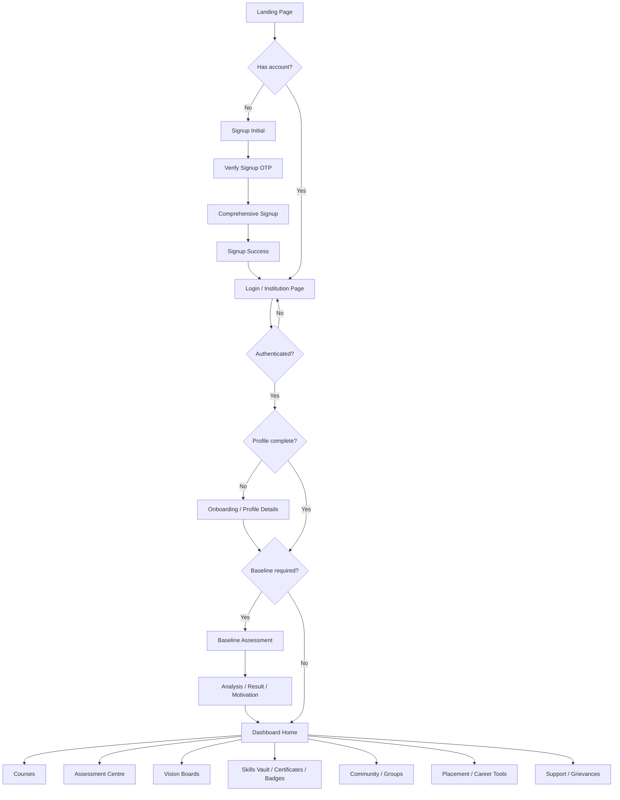
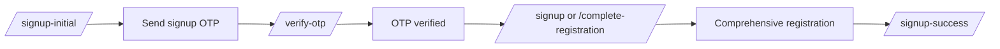
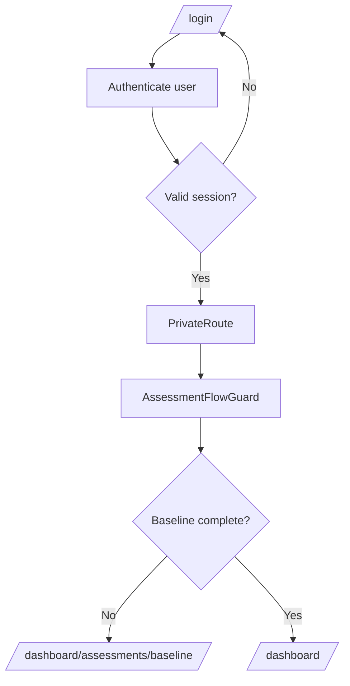
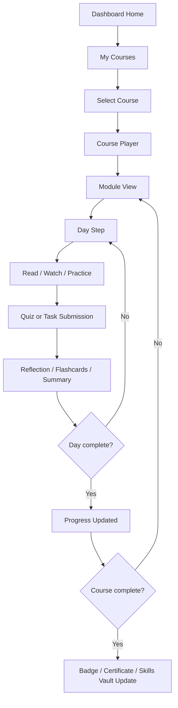
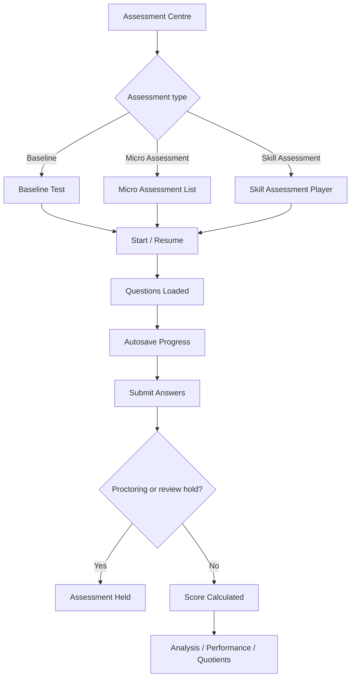
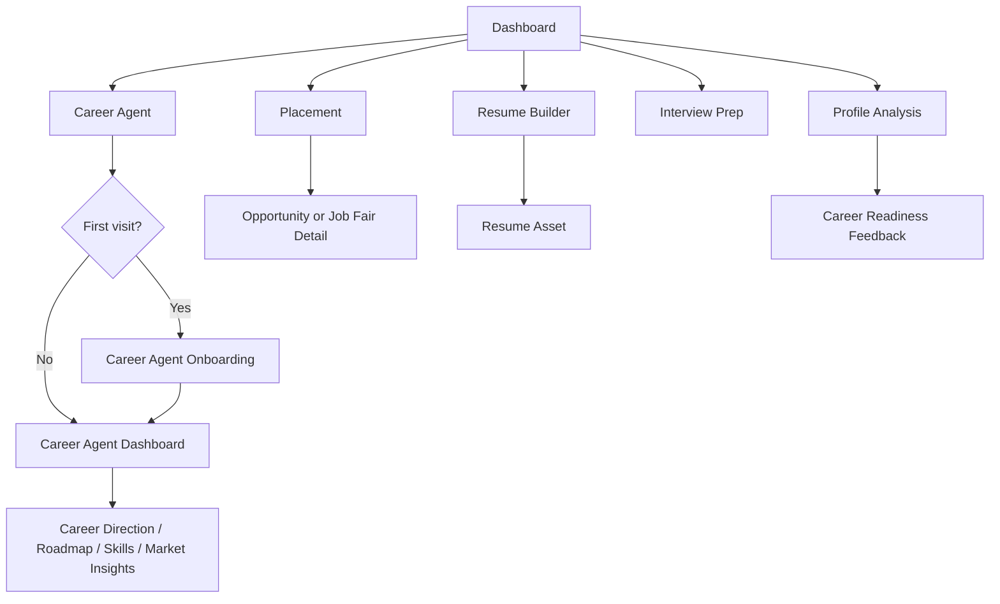
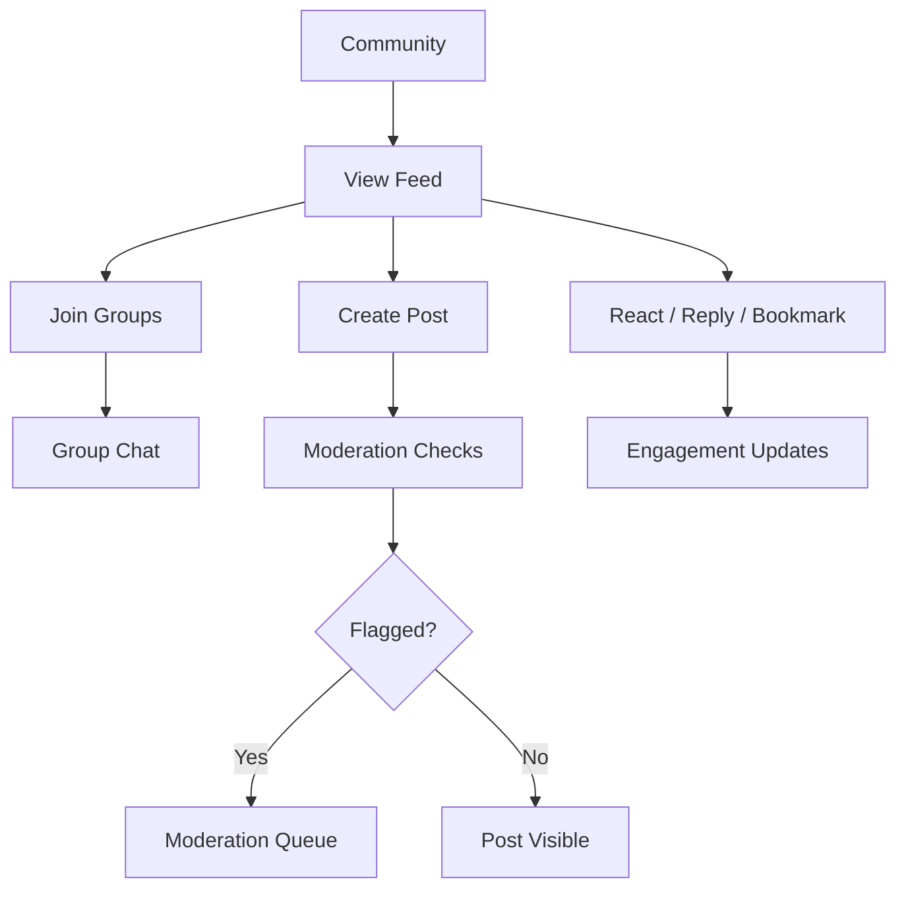
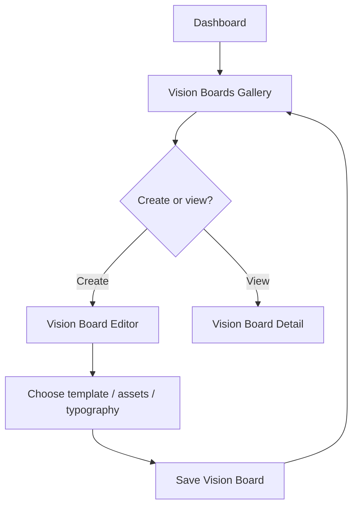
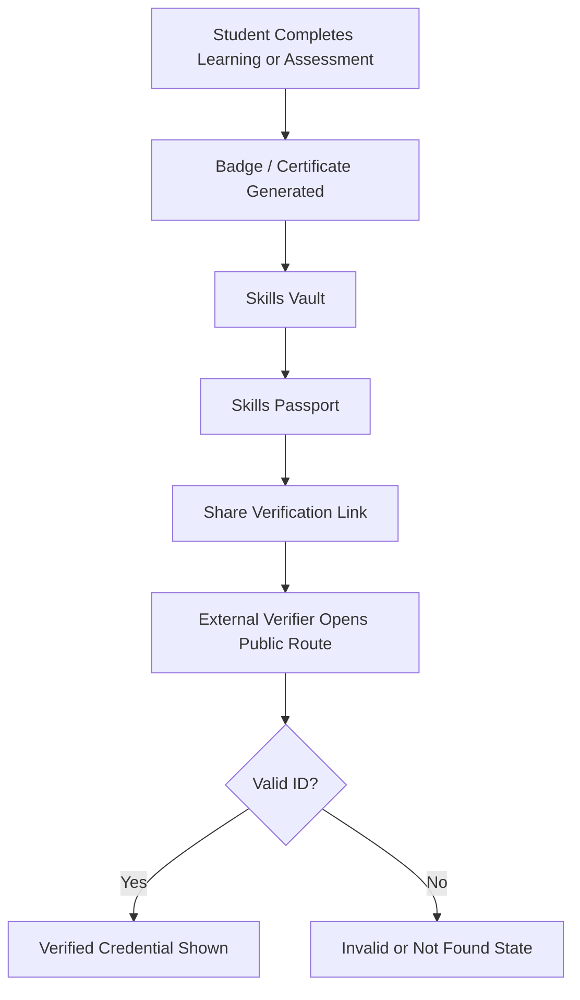
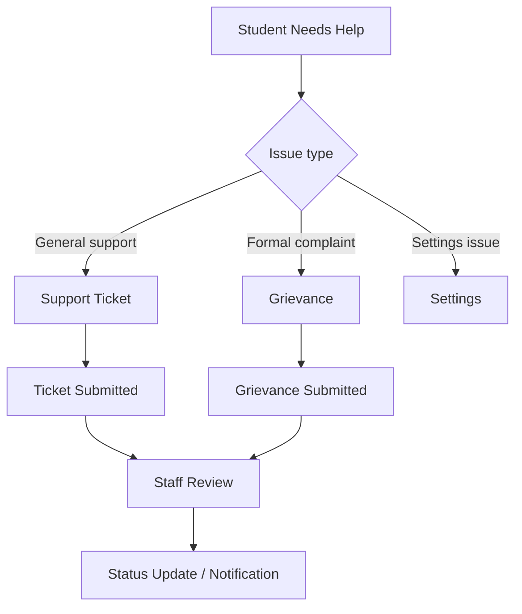

# SMAART Institute User Journey Map and User Flow

## Purpose

This document explains how a student moves through the SMAART Institute platform from first visit to long-term learning, assessment, career readiness, community participation, and certification.

It is based on the current project structure, especially:
- `front-end/src/components/AnimatedRoutes.jsx`
- `front-end/src/components/DashboardSidebar.jsx`
- `SYSTEM_END_TO_END_FLOW_DOCUMENTATION.md`
- `SMAART_MINDS_COMPLETE_USER_JOURNEY.md`
- backend route modules in `back-end/routes`

## Product Snapshot

SMAART Institute is a student development dashboard that combines:
- Institution-based access
- Student registration and profile building
- Baseline and skill assessments
- Course learning paths
- Vision boards
- SMAART toolkit and CGPA tools
- Skills vault, certificates, badges, and passport verification
- Community, groups, notes, todos, support, and grievances
- Placement, AI career coach, and career agent flows

## Primary Personas

### Student

The main user. They register, complete profile details, take assessments, learn through course modules, track progress, build career assets, join community spaces, and collect badges/certificates.

### Institution / College

Provides access context, student identity, course or program structure, and institutional trust.

### Admin / Staff

Manages courses, proctoring, student support, tickets, grievances, moderation, and operational oversight.

### External Verifier

Public user who verifies a certificate, badge, skills passport, or resume through public verification links.

## High-Level Journey Map

| Stage | Student Goal | Key Screens / Routes | System Touchpoints | Emotion / Need | Success Outcome |
| --- | --- | --- | --- | --- | --- |
| 1. Discover | Understand what SMAART offers | `/`, `/institution/:id`, `/login` | Landing page, institution page | Curious, needs trust | Student chooses institution or starts signup/login |
| 2. Register / Login | Securely access their account | `/signup-initial`, `/verify-otp`, `/signup`, `/signup-success`, `/login` | Auth, OTP, registration APIs | Cautious, needs clarity | Account created or authenticated |
| 3. Complete Profile | Build student identity and preferences | `/dashboard/onboarding`, `/profile`, `/dashboard/profile` | Registration, user, upload, college data | Slight friction, needs progress feedback | Profile becomes usable for personalization |
| 4. Baseline Assessment | Establish current skill/quotient level | `/dashboard/assessments/baseline`, `/assessment/:stage`, `/analysis`, `/motivational` | Assessment, result, baseline result APIs | Focused, needs guidance and fairness | Baseline result generated and dashboard access unlocked |
| 5. Dashboard Home | See priorities and next actions | `/dashboard` | User context, notifications, progress, banners | Oriented, needs a clear next step | Student sees courses, progress, tools, alerts |
| 6. Learn | Continue course modules and daily tasks | `/dashboard/courses`, `/dashboard/courses/:courseId/player`, `/dashboard/courses/:courseId/modules/:moduleId/days/:dayId` | Courses, enrollments, task results, video progress | Productive, needs continuity | Course progress increases and modules unlock |
| 7. Assess and Improve | Take micro/skill assessments and view performance | `/dashboard/assessment-centre`, `/dashboard/micro-assessments`, `/skill-assessment/:skillName`, `/dashboard/performance`, `/dashboard/quotients-grid` | Assessments, results, stage results, proctoring | Challenged, needs feedback | Scores, insights, and improvement direction |
| 8. Build Career Assets | Prepare for jobs and career direction | `/dashboard/placement`, `/dashboard/profile-analysis`, `/dashboard/resume-builder`, `/dashboard/interview-prep`, `/dashboard/career-agent` | Placement, resumes, career intelligence, AI coach | Ambitious, needs personalization | Resume, role direction, interview prep, job opportunities |
| 9. Engage and Reflect | Participate in community and manage tasks | `/dashboard/community`, `/dashboard/groups`, `/dashboard/notes`, `/dashboard/todos`, `/dashboard/vision-boards` | Community, groups, notes, todos, vision board APIs | Connected, needs motivation | Posts, groups, notes, goals, vision boards |
| 10. Recognition | Collect and share proof of growth | `/dashboard/skills-vault`, `/dashboard/skills-passport`, `/dashboard/certificate`, `/dashboard/badges` | Certificates, badges, user certificates | Proud, needs credibility | Verifiable achievements and portfolio assets |
| 11. Support | Resolve blockers | `/dashboard/support`, `/dashboard/grievances`, `/dashboard/settings`, `/dashboard/notifications` | Tickets, grievances, notifications, settings | Frustrated or uncertain, needs response | Issue submitted, tracked, resolved |
| 12. External Verification | Allow others to verify achievements | `/verify-certificate/:certificateId`, `/verify-passport/:passportId`, `/verify-resume/:resumeId`, `/verify-badge/:badgeId` | Public verification APIs | Trust check | Achievement validity confirmed |

## Main Student User Flow

## Route-Based User Flow

### Public Entry

1. Student visits `/`.
2. Student selects an institution through `/institution/:id` or opens `/login`.
3. Public users can also verify credentials through:
   - `/verify-certificate`
   - `/verify-passport`
   - `/verify-resume`
   - `/verify-badge`
   - the same routes with an ID parameter.

### Signup Flow

Backend touchpoints:
- `auth.js`
- `registrations.js`
- `uploadRoutes.js`
- `colleges.js`

### Login and Protected Dashboard Flow

Backend touchpoints:
- `auth.js`
- `security.js`
- `students.js`
- `users.js`
- `baselineresults.js`

## Dashboard Information Architecture

The dashboard navigation currently exposes these major areas:

| Area | Main Route | Purpose |
| --- | --- | --- |
| Home | `/dashboard` | Student summary, progress, banners, widgets, next actions |
| My Courses | `/dashboard/courses` | Course list, enrollment progress, module entry |
| Assessment Centre | `/dashboard/assessment-centre` | Baseline, micro assessments, skill checks |
| Vision Boards | `/dashboard/vision-boards` | Goal visualization and vision board editor/gallery |
| SMAART Toolkit | `/dashboard/smaart-toolkit` | Student tools and utilities |
| Skills Vault | `/dashboard/skills-vault` | Stored skills, credentials, career assets |
| Community | `/dashboard/community` | Posts, notices, tasks, engagement |
| Placement | `/dashboard/placement` | Job fair, opportunities, placement details |
| My Notes | `/dashboard/notes` | Student learning notes |
| To-Do & Calendar | `/dashboard/todos` | Task planning and deadlines |
| Settings | `/dashboard/settings` | Preferences and account settings |
| Help / Support | `/dashboard/support` | Tickets and help requests |
| Grievances | `/dashboard/grievances` | Formal issue reporting |

## Learning Flow

Backend touchpoints:
- `courses.js`
- `courseEnrollments.js`
- `tasks.js`
- `notes.js`
- `badges.js`
- `certificates.js`
- `notifications.js`

## Assessment Flow

Backend touchpoints:
- `assessments.js`
- `results.js`
- `baselineresults.js`
- `stageresults.js`
- `questionBanks.js`
- `proctoring.js`
- `ppiRoutes.js`

## Career and Placement Flow

Backend touchpoints:
- `placements.js`
- `jobApplications.js`
- `resumes.js`
- `aiCareerCoach.js`
- `careerAgent.js`
- `careerIntelligence.js`

## Community Flow

Backend touchpoints:
- `community.js`
- `groups.js`
- `communityTaskProgressRoutes.js`
- `moderation.js`
- `moderationQueue.js`
- `notifications.js`

## Vision Board Flow

Frontend routes:
- `/dashboard/vision-boards`
- `/vision-board-pro/create`
- `/vision-board-pro/gallery`
- `/vision-board/view/:id`

Backend touchpoints:
- `visionBoardRoutes.js`
- `visionBoardProRoutes.js`
- `userVisionBoardRoutes.js`

## Recognition and Verification Flow

Student routes:
- `/dashboard/skills-vault`
- `/dashboard/skills-passport`
- `/dashboard/certificate`
- `/dashboard/badges`

Public routes:
- `/verify-certificate/:certificateId`
- `/verify-passport/:passportId`
- `/verify-resume/:resumeId`
- `/verify-badge/:badgeId`

Backend touchpoints:
- `badges.js`
- `certificates.js`
- `userCertificates.js`
- `resumes.js`

## Support Flow

Backend touchpoints:
- `tickets.js`
- `grievances.js`
- `escalations.js`
- `notifications.js`

## Key Experience Rules

1. Institution and authentication are the trust gate before the student reaches private features.
2. Baseline assessment acts as a progress gate for the main dashboard experience.
3. Dashboard Home should always answer: "What should I do next?"
4. Learning, assessment, career, and recognition loops should feed each other.
5. Achievements should become visible in Skills Vault, certificates, badges, and public verification routes.
6. Support and grievances should remain available without blocking learning progress.

## Opportunity Notes

| Area | Recommendation |
| --- | --- |
| Navigation | Keep the main dashboard nav focused on the current high-value destinations: Home, Courses, Assessment Centre, Vision Boards, Toolkit, Skills Vault, Community, Placement, Notes, Todos. |
| Baseline Gate | Make the reason for baseline gating very clear to students before redirecting them. |
| Career Flow | Connect baseline results, profile data, skills vault, and career agent recommendations visibly. |
| Recognition | Show students where each badge/certificate came from and what action unlocks the next one. |
| Support | Add clear status states: submitted, in review, waiting for student, resolved. |
| Public Verification | Keep verification pages simple and trust-focused, with credential validity as the first visible result. |

## One-Line Flow Summary

Student discovers SMAART, registers through OTP, completes profile, takes the baseline assessment, lands on the dashboard, learns through courses, improves through assessments, builds career assets, engages with the community, earns verifiable credentials, and returns regularly through progress, notifications, and support loops.
