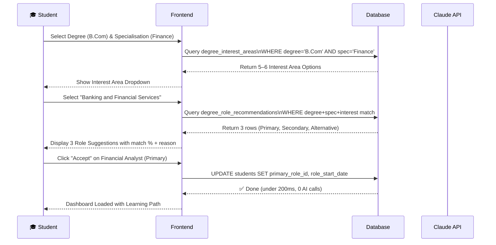
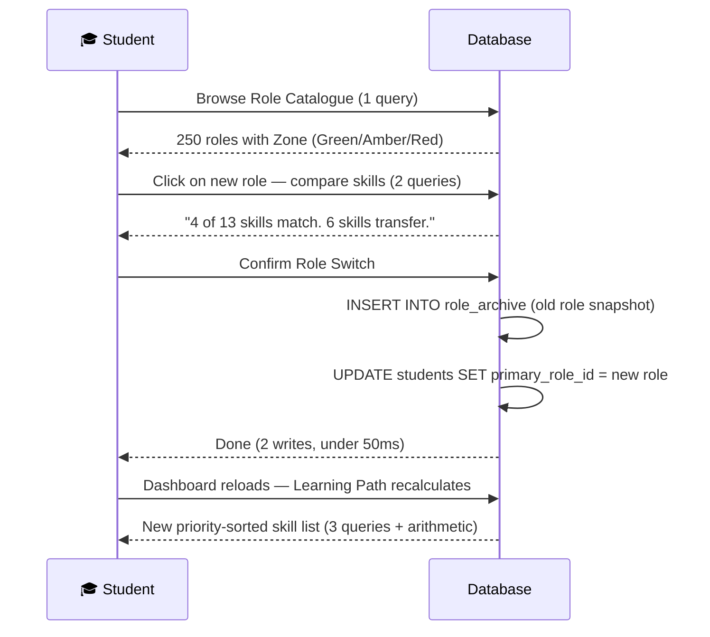
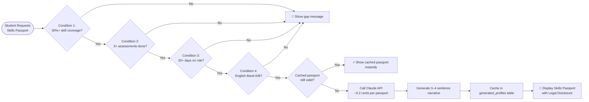

# SMAART Career Intelligence Platform — AI Agent System Documentation

> **Document Version:** 1.0 | **Created:** March 10, 2026  
> **Source:** `aiagent.pdf` — Developer Build Guide v1.0  
> **Scope:** Complete solution design for Role Data Generation, Student Matching, Role Changes, Learning Paths, and Skills Passport Generation  
> **Target Scale:** 50,000 Students | 25 Colleges | 250 Roles

---

## Table of Contents

1. [What the PDF Explains — System Overview](#1-what-the-pdf-explains--system-overview)
2. [The Critical Design Principle](#2-the-critical-design-principle)
3. [System Flow Diagrams](#3-system-flow-diagrams)
4. [Database Architecture](#4-database-architecture)
5. [How to Implement — Step-by-Step Plan](#5-how-to-implement--step-by-step-plan)
6. [Cost Breakdown](#6-cost-breakdown)
7. [Pre-Launch Checklist](#7-pre-launch-checklist)

---

## 1. What the PDF Explains — System Overview

The PDF is a **complete Developer Build Guide** for the **SMAART Career Intelligence Platform**. It is a career guidance system built for Indian college students to:

- Discover the right career paths based on their degree, specialisation, and interests
- Learn what skills are needed for their chosen role
- Track their learning progress in a personalised way
- Change roles freely without losing progress
- Generate a verified **Skills Passport** to show employers

### The 6 Core Components

| Component | What It Does | Uses AI? | Build Time |
|---|---|---|---|
| **Role Data (250 profiles)** | Stores role info — skills, tools, salary, AI exposure, narrative | Yes — Claude API during generation only, static after | 7–8 days |
| **Matching Engine** | Suggests 3 roles (Primary, Secondary, Alternative) based on degree + interests | Yes — Claude to build the table once; DB queries at runtime | 3–4 days |
| **Role Change System** | Lets students switch roles freely, archives old progress, recalculates learning path | No — pure database queries | 2–3 days |
| **Learning Path Engine** | Shows prioritised skill list + free courses for the student's role | No — arithmetic formula on DB data | 2–3 days |
| **Skills Passport Generator** | Creates a verified capability document when a student is eligible | Yes — one Claude API call per passport, cached | 2–3 days |
| **Engagement Score Calculator** | Gives placement officers a Green/Amber/Red score per student | No — formula on DB data | 1–2 days |

> **Total build time:** ~20–24 working days for one developer.

---

## 2. The Critical Design Principle

> ✅ **AI is used ONLY during the BUILD phase to generate static data.**  
> At runtime (when students browse, switch roles, or view learning paths), **everything is a database query — zero AI calls.**

This means:
- The platform costs **almost nothing to run** at any scale.
- 50,000 students or 500,000 students — the database query cost is the same.
- The **only runtime AI calls** are for: quotient assessment scoring (Tier 2) and Skills Passport narrative generation — both are **rare and cached**.

---

## 3. System Flow Diagrams

### 3.1 — Overall Build vs. Runtime Split

```
┌─────────────────────────────────────────────────────────────┐
│                      BUILD PHASE (One-time)                 │
│                                                             │
│   Role CSV  ──►  Claude API  ──►  Verify  ──►  Database    │
│   (250 roles)    (2-step)        (Human)       Loaded ✅    │
│                                                             │
│   Degree List ──► Claude API ──► Matching Table ──► DB ✅  │
└─────────────────────────────────────────────────────────────┘
                              │
                              ▼
┌─────────────────────────────────────────────────────────────┐
│                   RUNTIME PHASE (Live Students)             │
│                                                             │
│   Student Onboards  ──►  DB Query  ──►  3 Role Suggestions │
│   Student Picks Role ──► DB Query  ──►  Learning Path      │
│   Student Completes Skills ──► DB Query ──► Updated Path   │
│   Student Changes Role ──►  2 DB Writes ──► Instant Done   │
│   Student Requests Passport ──► Eligibility DB Check       │
│                         ──► ONE Claude API Call (cached)   │
└─────────────────────────────────────────────────────────────┘
```

---

### 3.2 — Full Student Journey Flow

```mermaid
flowchart TD
    A([🎓 Student Signs Up]) --> B[Onboarding:\nEnter Degree + Specialisation]
    B --> C[Select Career Interest Area\nfrom Dropdown]
    C --> D[(DB Query:\ndegree_role_recommendations)]
    D --> E[Display 3 Role Suggestions:\n🥇 Primary | 🥈 Secondary | 🔀 Alternative]
    E --> F{Student Chooses}

    F -->|Accepts a suggestion| G[Role Set as Primary\nrole_start_date = Today]
    F -->|Browses all 250 roles| H[Role Catalogue Browser\nFilter by Family / Zone / AI Exposure]
    H --> G

    G --> I[Dashboard Loads:\nPersonalised Learning Path]
    I --> J[(DB: Priority Formula\nHigh=10 + Cross-Role=+5 + Prereq=+8)]
    J --> K[Skills List Sorted by Priority\nwith Free Course Links]

    K --> L{Student Action}
    L -->|Marks Skill Complete| M[Learning Path Recalculates\nAutomatically]
    M --> K
    L -->|Changes Role| N[Archive Old Role\nINSERT INTO role_archive]
    N --> O[Update Student Record\n2 DB Writes — Under 50ms]
    O --> K

    L -->|Requests Skills Passport| P{Eligibility Check\n4 DB Queries}
    P -->|❌ Not yet eligible| Q[Show: What to complete]
    P -->|✅ All 4 conditions met| R[One Claude API Call\nGenerate Narrative]
    R --> S[Cache in generated_profiles\nDisplay Skills Passport PDF]
    S --> T([🏆 Employer Reviews Passport])
```

---

### 3.3 — Role Matching Flow (Onboarding)



---

### 3.4 — Role Change Flow (Database Operations)



---

### 3.5 — Skills Passport Eligibility & Generation



---

### 3.6 — Engagement Score Formula

```
Engagement Score =
   (Learning Progress × 0.30)
 + (Assessment Completion × 0.25)
 + (Activity Recency × 0.20)
 + (Role Stability × 0.15)
 + (Course Completion Rate × 0.10)

Where:
  Learning Progress    = (skills completed / total skills) × 100
  Assessment Completion = (assessments done / available) × 100
  Activity Recency:
    Active in last 7 days   = 100
    Active in last 14 days  = 75
    Active in last 30 days  = 50
    Active in last 60 days  = 25
    Inactive 60+ days       = 0
  Role Stability:
    0–1 role changes in 60 days = 100
    2–3 changes                 = 70
    4–5 changes                 = 40
    6+ changes                  = 10

Score 70+  → 🟢 Green
Score 40–69 → 🟡 Amber
Score < 40  → 🔴 Red (visible to placement officers only)
```

---

## 4. Database Architecture

### The 11 Tables

| Table | Purpose | Status |
|---|---|---|
| `roles` | 250 role profiles — name, job family, AI exposure, salary, narrative | Existing — add new columns |
| `role_skills` | Maps which skills belong to which role + importance level | Existing |
| `skills` | Master list of all skills (technical + AI tools + human) | Existing |
| `courses` | Free courses mapped to skills (Coursera, Google, NPTEL, Microsoft Learn) | Existing |
| `students` | Student profiles — current role, degree, specialisation | Existing — add new columns |
| `student_skill_completions` | Tracks which skills each student has completed | Existing |
| `degree_role_recommendations` | Pre-built matching table: degree + spec + interest → 3 recommended roles | **NEW** |
| `degree_interest_areas` | Dropdown options for each degree-specialisation combination | **NEW** |
| `degree_role_zones` | Green/Amber/Red zone classification for each degree-role pair | Existing from career change design |
| `role_archive` | Snapshot when student switches away from a role | **NEW** |
| `generated_profiles` | Cached AI-generated Skills Passport narratives | **NEW** |

### Key Schema Details

```sql
-- degree_interest_areas (NEW)
id INT AUTO_INCREMENT PRIMARY KEY,
degree_type TEXT,           -- e.g. 'B.Com', 'B.Tech'
specialisation TEXT,        -- e.g. 'Finance', 'Computer Science'
interest_area_name TEXT,    -- e.g. 'Banking and Financial Services'
display_order INT

-- degree_role_recommendations (NEW)
id INT AUTO_INCREMENT PRIMARY KEY,
degree_type TEXT,
specialisation TEXT,
interest_area TEXT,
role_id INT FK → roles,
recommendation_type TEXT,   -- 'Primary' | 'Secondary' | 'Alternative'
match_strength INT,         -- 1–100
reason TEXT

-- role_archive (NEW)
id INT AUTO_INCREMENT PRIMARY KEY,
student_id INT FK → students,
role_id INT FK → roles,
skills_covered_at_archive INT,
total_skills_at_archive INT,
days_on_role INT,
archived_date DATE

-- generated_profiles (NEW — Passport Cache)
student_id INT FK → students,
role_id INT FK → roles,
narrative_text TEXT,
generated_date DATETIME,
scores_snapshot JSON,
coverage_snapshot DECIMAL
```

---

## 5. How to Implement — Step-by-Step Plan

### ⚡ Before You Start — Pre-Requisites

1. **Get Anthropic API key:** Go to [console.anthropic.com](https://console.anthropic.com), create account, add **$10 credits** minimum.
2. **Prepare `roles.csv`:** One column with 250 role names. Start with 100 for Batch 1.
3. **Test the API connection:**

```bash
curl https://api.anthropic.com/v1/messages \
  -H "Content-Type: application/json" \
  -H "x-api-key: YOUR_API_KEY" \
  -H "anthropic-version: 2023-06-01" \
  -d '{"model":"claude-sonnet-4-20250514","max_tokens":100,"messages":[{"role":"user","content":"Say hello"}]}'
```

> If you get "Hello" back, you're ready. If you get an error, check your API key and billing.

---

### Week 1 — Role Data Generation (Days 1–5)

#### The Two-Step AI Generation Process

> ⚠️ **Never ask AI to generate everything in one prompt.** Two separate steps = much higher data quality.

**Step 1 Prompt — Structured JSON (Copy this exactly)**

```
You are a career intelligence analyst specialising in the Indian
job market. Generate accurate, specific data for the following
role. Do NOT invent or hallucinate any information. If you are
uncertain about something, say "needs verification" instead of
guessing.

ROLE: [Financial Analyst]
EXPERIENCE LEVEL: 0-3 years (entry level, fresh graduate)
COUNTRY: India

Generate the following in valid JSON format:
1. "technical_skills": List exactly 8-10 technical skills that
   are SPECIFIC to this role in India.
2. "ai_tools": List exactly 4-6 AI tools that professionals in
   this role in India are ACTUALLY using in 2025-2026.
3. "human_skills_priority": Top 5 ranked from: Analytical
   Thinking, Resilience and Adaptability, Leadership, Creative
   Thinking, Motivation and Self-Awareness, Empathy and Active
   Listening, Curiosity and Lifelong Learning, Execution and
   Reliability, Collaboration, Stakeholder Communication.
4. "salary_range": low (Tier 2 entry) and high (Tier 1, 2-3 yrs)
5. "ai_exposure": percentage, level (Low/Moderate/High), detail,
   human_value
6. "emerging_role_connection": 1-2 emerging roles linked to this

Output ONLY the JSON. No explanations before or after.
```

**Step 2 Prompt — Narrative (Copy this exactly)**

```
You are writing for Indian college students aged 18-24 who are
exploring career options. Write in simple, clear English.

Based on this role data: [PASTE JSON FROM STEP 1]

Write THREE short paragraphs for the role of [Role Name]:
- PARAGRAPH 1: "What This Role Actually Does" (4-5 sentences)
- PARAGRAPH 2: "How AI Is Changing This Role" (3-4 sentences)  
- PARAGRAPH 3: "Who Should Consider This Role" (3-4 sentences)

Keep each under 80 words. Total under 250 words. No bullet points.
```

#### Daily Execution Plan

| Day | Task | Output |
|---|---|---|
| **Day 1** | Setup Claude API. Prepare `roles.csv` (100 roles). Run Step 1 for all 100. | 100 JSON files |
| **Day 2** | Run Step 2 for all 100. Begin AI tool + salary verification for Batch 1. | 100 narratives |
| **Day 3** | Complete verification Batch 1. Load into database. Run test queries. | 100 verified profiles in DB ✅ |
| **Day 4** | Generate Batch 2 (roles 101–175). Begin verification. | 75 more profiles |
| **Day 5** | Generate Batch 3 (roles 176–250). Verify Batch 2. | All 250 generated, 175 verified |

#### Verification (Do NOT Skip)

| Check | Tool/Method | Time |
|---|---|---|
| ⚠️ AI Tool Names (hallucination risk) | Google each tool name — if it doesn't exist, remove it | ~5 hours for 250 roles |
| ⚠️ Salary Ranges (frequently wrong) | Verify ALL on [AmbitionBox](https://ambitionbox.com/salaries) for 0–3 yrs experience | ~6 hours |
| Technical Skills (too generic?) | Scan each list — remove anything that applies to every role | ~4 hours |
| AI Exposure % | Cross-check against Anthropic Economic Index dataset on Hugging Face | ~3 hours |

---

### Week 2 — Matching Engine (Days 6–10)

#### Matching Table Generation Prompt

```
You are a career counsellor for Indian college students.

DEGREE: [B.Com]
SPECIALISATION: [Finance]
EXPERIENCE LEVEL: Fresh graduate (0-1 years)

For each interest area below, recommend exactly 3 roles from
the approved role list: one Primary (strongest match), one
Secondary (good alternative), one Alternative (different
direction using transferable skills).

Interest Area 1: "Banking and Financial Services"
Interest Area 2: "Corporate Finance and Accounting"
Interest Area 3: "Data and Analytics"
Interest Area 4: "Sales and Marketing"
Interest Area 5: "General / Exploring Options"

Provide: interest_area, role_name, recommendation_type,
match_strength (1-100), reason (one sentence).

APPROVED ROLE LIST: [PASTE ALL 250 ROLE NAMES HERE]
Output as JSON array. No explanations.
```

| Day | Task | Output |
|---|---|---|
| **Day 6** | Complete Batch 3 verification. All 250 roles verified in DB. | 250 verified role profiles ✅ |
| **Day 7** | Generate `degree_interest_areas` + `degree_role_recommendations` tables. | 400–600 interest areas; 1,200–1,800 matching entries |
| **Day 8** | Generate `degree_role_zones` table. Human spot-check matching data. | Zone classifications for all 250 roles × all degree types |
| **Day 9** | Build onboarding flow code: dropdown → interest → 3 suggestions → role select. | Working onboarding flow |
| **Day 10** | Build role catalogue browser: 250 roles, filterable by family/zone/AI exposure. | Browsable role catalogue |

---

### Week 3 — Core Features (Days 11–15)

| Day | Task | Output |
|---|---|---|
| **Day 11** | Build role change system: browse → compare → confirm → archive → switch. | Working role change flow |
| **Day 12** | Build learning path engine: priority formula + skill display + course links. | Learning path on student dashboard |
| **Day 13** | Build Skills Passport: eligibility check, data display, Claude integration, caching. | Working passport generation |
| **Day 14** | Build engagement score batch job + placement officer dashboard. | Engagement scores visible to officers |
| **Day 15** | Full end-to-end integration testing with 10 test student profiles. | 10 complete journeys tested ✅ |

#### Learning Path Priority Formula (Implement This in Code)

```javascript
// For each uncompleted skill in the student's primary role:
function calculatePriority(skill, studentData) {
  let priority = 0;

  // Role Importance
  if (skill.importance === 'High')   priority += 10;
  if (skill.importance === 'Medium') priority += 7;
  if (skill.importance === 'Low')    priority += 4;

  // Cross-Role Bonus (if student has secondary role)
  if (skill.neededForSecondaryRole)                   priority += 5;
  if (skill.neededForSecondaryRole && skill.neededForAlternativeRole) priority += 10;

  // Almost-There Bonus
  if (studentData.hasCompletedPrerequisite(skill))    priority += 8;

  return priority;
}

// Sort all uncompleted skills by priority DESC → this IS the learning path
```

#### Skills Passport Eligibility Check

```sql
-- Condition 1: 30%+ skill coverage
SELECT COUNT(*) FROM student_skill_completions
WHERE student_id = X AND skill_id IN (SELECT skill_id FROM role_skills WHERE role_id = Y);
-- coverage = completed / total >= 0.30

-- Condition 2: 3+ assessments
SELECT COUNT(*) FROM student_quotient_scores WHERE student_id = X AND score IS NOT NULL;
-- must be >= 3

-- Condition 3: 30+ days on role
SELECT DATEDIFF(NOW(), primary_role_start_date) FROM students WHERE id = X;
-- must be >= 30

-- Condition 4: English passed
SELECT english_status FROM students WHERE id = X;
-- must be 'Band A' or 'Band B Complete'
```

---

### Week 4 — Pilot and Scale (Days 16–20)

| Day | Task | Output |
|---|---|---|
| **Day 16–17** | Fix integration bugs. Load test: 1,000 concurrent users, all under 500ms. | All bugs fixed, performance confirmed |
| **Day 18–19** | Open platform to first 2–3 colleges (pilot). Monitor logs, get feedback. | Pilot running with real students |
| **Day 20** | Fix pilot issues. Prepare for full launch. | Platform confirmed stable ✅ |

> After Week 4 — open to all 25 colleges. You have a working system for 50,000 students.

---

## 6. Cost Breakdown

### Build Phase (One-Time Only)

| Item | Cost |
|---|---|
| Claude API for 250 role profiles | $9 (₹750) |
| Claude API for matching table | $5 (₹420) |
| Claude API for zone classifications | $3 (₹250) |
| Buffer for testing + iterations (3×) | $15 (₹1,250) |
| **Total Build AI Cost** | **$32 (₹2,670)** |

### Runtime Phase (Per Semester, 50,000 Students)

| Item | Volume | Cost |
|---|---|---|
| Role browsing, matching, role changes, learning paths | Unlimited for 50,000 students | **₹0** (all DB queries) |
| Quotient assessment scoring (Tier 2) | 20,000 assessments @ $0.005 each | $100 (₹8,400) |
| Skills Passport narrative generation | 15,000 passports @ $0.002 each | $30 (₹2,500) |
| **Total per semester** | 50,000 students | **$130 (₹10,900)** |
| **Total per year** | 2 semesters | **$260 (₹21,800)** |

### Infrastructure (Monthly)

| Item | Specification | Monthly Cost |
|---|---|---|
| Database server | PostgreSQL on AWS RDS db.t3.medium | ₹4,000–5,000 |
| Application server | 2 vCPU, 4GB RAM (EC2 t3.medium) | ₹3,000–4,000 |
| Storage | 50GB database + 10GB files | ₹500–1,000 |
| CDN + static hosting | Frontend assets | ₹500–1,000 |
| **Total monthly** | | **₹8,000–11,000** |

### 💰 Business Case

| Item | Annual |
|---|---|
| AI API costs | ₹21,800 |
| Infrastructure | ₹96,000–1,32,000 |
| Domain, SSL, email | ₹5,000 |
| **Total Annual Operating Cost (50,000 students)** | **₹1.2–1.6 lakh** |
| Revenue (25 colleges × ₹2.5 lakh avg) | ₹62.5 lakh |
| **Operating Margin** | **Over 97%** |

---

## 7. Pre-Launch Checklist

Before going live with the first college, **every single item must be confirmed:**

| # | Item | Confirmed By | Date |
|---|---|---|---|
| 1 | 250 role profiles loaded and verified in database | | |
| 2 | All roles have 12–20 skills mapped in `role_skills` | | |
| 3 | AI tool names verified — no hallucinated tools in the data | | |
| 4 | Salary ranges verified on AmbitionBox for all 250 roles | | |
| 5 | Matching table loaded: every degree-spec has 5–6 interest areas | | |
| 6 | Every interest area has exactly 3 recommendations (Primary, Secondary, Alternative) | | |
| 7 | Zone classifications loaded for all degree-role combinations | | |
| 8 | Onboarding tested: degree → spec → interest → 3 suggestions | | |
| 9 | Role catalogue browsable: 250 roles, all filters working | | |
| 10 | Role change tested: switch, archive, learning path recalculates | | |
| 11 | Learning path shows prioritised skills + course links (top 10 popular roles) | | |
| 12 | Skills Passport generates correctly for eligible students with cached narrative | | |
| 13 | Engagement score correct for 5 profiles: Green, Amber, Red | | |
| 14 | Claude API fallback works: passport generates without narrative if API is down | | |
| 15 | Missing degree fallback: unmapped degrees get generic recommendations (no error) | | |
| 16 | Course link checker run: all course URLs return HTTP 200 | | |
| 17 | Legal disclosure appears on every Skills Passport (hardcoded, never AI-generated) | | |
| 18 | Score cap enforced: no quotient score shows above 95 | | |
| 19 | Load test passed: 1,000 concurrent users, all responses under 500ms | | |
| 20 | Placement officer dashboard shows: student list, engagement, batch analytics, skill coverage | | |

> **When every row has a name and a date — you are ready to go live. Not before.**

---

## Quick Reference Summary

```
📋 START HERE:
   1. Get Anthropic API key + $10 credits
   2. Prepare roles.csv (250 roles)
   3. Run 2-step generation (Step1=JSON, Step2=Narrative)
   4. Verify: AI tools (Google), Salaries (AmbitionBox)
   5. Load into DB
   6. Generate matching tables with Claude
   7. Build matching engine (runtime = DB only)
   8. Build learning path (priority formula)
   9. Build role change system (2 DB writes)
   10. Build Skills Passport (eligibility + 1 Claude call cached)
   11. Build engagement score batch job (weekly Sunday)
   12. Test everything (Sections 2.9, 3.7, 4.7, 5.5, 6.5, 7.3)
   13. Complete Pre-Launch Checklist (20 items)
   14. Pilot with 2-3 colleges
   15. Full launch to all 25 colleges 🚀
```

---

*Document created from: `aiagent.pdf` — SMAART Career Intelligence Platform Developer Build Guide v1.0 (Confidential)*  
*Documented by: Antigravity AI | March 10, 2026*
