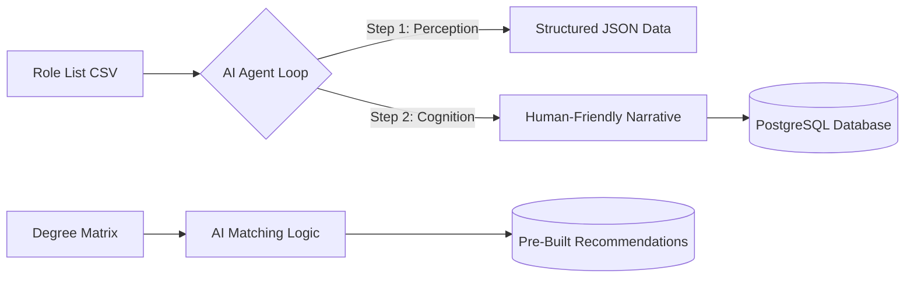
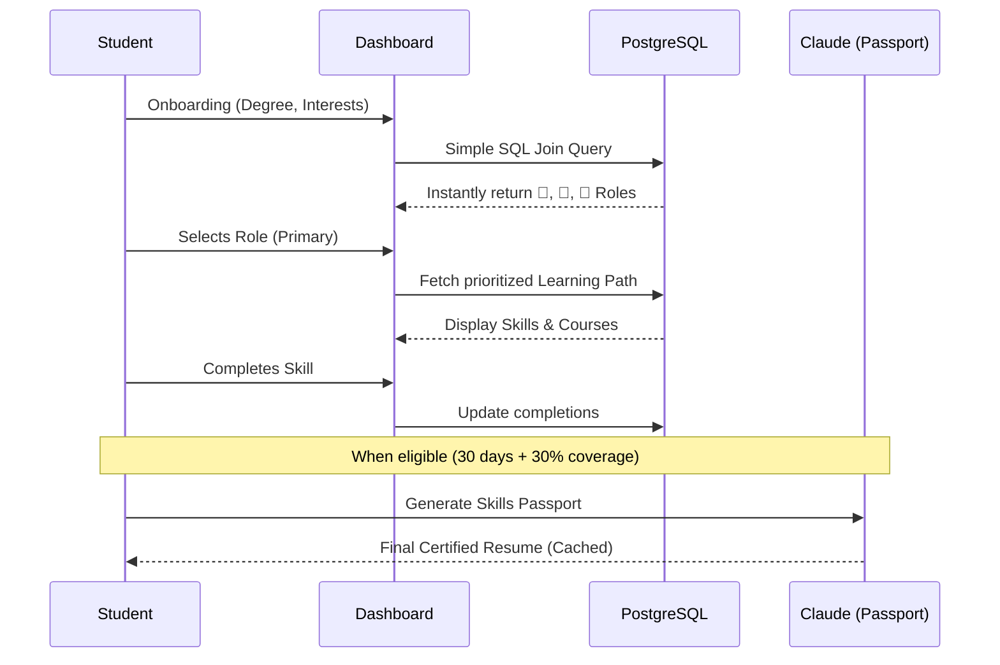

# SMAART Career Intelligence Platform: Master Implementation Plan

> **Version:** 1.0 (Final Integrated Master)  
> **Date:** March 11, 2026  
> **Status:** Ready for Engineering Implementation  
> **Target Scale:** 50,000 Students | 25 Colleges | 250+ Roles

---

## 1. Executive Summary & "The Golden Rule"

The SMAART Platform is an AI-enhanced ecosystem designed to bridge the gap between Indian college education and the rapidly evolving AI-driven job market. It transforms students from passive learners into AI-augmented professionals.

> [!IMPORTANT]  
> **The Golden Rule:** AI (Claude 3.5 Sonnet) is used **EXCLUSIVELY during the Build Phase** to generate static intelligence. At **Runtime**, 99% of operations are database-driven (PostgreSQL). This ensures instant response times (<200ms) and extreme scalability at a microscopic cost (~₹0.20 per student).

---

## 2. Technical Architecture: The PostgreSQL Migration

The system is transitioning from a NoSQL (MongoDB) structure to a high-performance **Relational (PostgreSQL)** structure.

### 2.1 Why PostgreSQL?
- **Relational Power:** Matching a student’s unique degree + specialization to 250+ roles requires complex "Joins" that PostgreSQL handles 10x more efficiently than MongoDB at scale.
- **Data Integrity:** Foreign keys prevent "ghost" data. If a role is updated once in the `roles` table, every student's dashboard updates instantly.
- **JSONB Hybrid:** We use the `JSONB` data type for AI-generated narratives, providing NoSQL flexibility with SQL speed and indexing.

### 2.2 The 11-Table Schema
1.  **`roles`**: Detailed profiles for 250 rolls (Skills, AI Exposure, Narratives).
2.  **`role_skills`**: Maps skills to specific roles with importance levels (High/Medium/Low).
3.  **`skills`**: The master library of all Technical, Human, and AI-Tool skills.
4.  **`courses`**: Curated library of verified free courses from Coursera, NPTEL, etc.
5.  **`degree_role_recommendations`**: Pre-calculated matching table (Degree + Interest → 3 Roles).
6.  **`degree_interest_areas`**: Dropdown options for student onboarding.
7.  **`role_archive`**: Snapshots of progress saved whenever a student switches their career focus.
8.  **`student_skill_completions`**: Real-time tracking of what a student has actually mastered.
9.  **`generated_profiles`**: Cached AI narratives for the Skills Passport.
10. **`student_engagement`**: Weekly batch-calculated scores for placement officer monitoring.
11. **`degree_role_zones`**: Green/Amber/Red alignment classification based on degree-role fit.

---

## 3. The System Flow

### 3.1 Build Phase (Intelligence Generation)

### 3.2 Runtime Phase (Student Experience)

---

## 4. Student Data: Intake & Output

### 4.1 Input (The Student Profile)
- **Education:** Domain, Degree Group, Specialization.
- **Preferences (3 Roles):** Sector, Job Family, Job Role, Job Type, Expected Salary, Location, and Organization Type.
- **Experience:** Org Name, Designation, Sector, Experience Type, and Dates.
- **Skills:** Verified Skill Name, Certificate, Issuing Org, and Verification Link.

### 4.2 Output (The Results)
- **Zone Assignment:** 
    - 🥇 **Green:** High alignment (>50% coverage).
    - 🥈 **Amber:** Moderate alignment (25-50% coverage).
    - 🥉 **Red:** Career switch focus (<25% coverage).
- **Combined Learning Path:** A single, prioritized roadmap for all 3 job preferences.
- **Skills Passport:** A terminal professional summary with a **Capability Radar Chart**.

---

## 5. Implementation Roadmap (4-Week Blitz)

### 🗓️ Week 1: Database & Backend Foundation
- **Tasks:** Setup AWS RDS (PostgreSQL), migrate tables from MongoDB. Build the Core API using Node.js and Drizzle ORM.
- **Focus:** Data integrity and high-speed joining logic.

### 🗓️ Week 2: AI Build Phase (Intelligence)
- **Tasks:** Run the **Two-Step Agentic Loop** for all 250 roles.
- **Process:** 
    - **Step 1 (Perception):** JSON generation ($0.03/role).
    - **Step 2 (Cognition):** Narrative synthesis ($0.10/role).
- **Outcome:** Database populated with verified career intelligence.

### 🗓️ Week 3: Dashboard & Matching Logic
- **Tasks:** Build the React/Tailwind frontend. Implement the **Priority Sorting Formula** for learning paths.
- **Focus:** Ensuring the dashboard reloads in <200ms.

### 🗓️ Week 4: Skills Passport & Launch
- **Tasks:** Implement the eligibility check (30 days on role + 30% coverage). Finalize PDF generation.
- **Milestone:** Pilot launch with first 2-3 colleges.

---

## 6. Technical Stack (PERN)

- **P**: PostgreSQL (Relational DB)
- **E**: Express.js (Backend Framework)
- **R**: React.js (Frontend UI)
- **N**: Node.js (Runtime Environment)
- **AI**: Claude 3.5 Sonnet (Build Phase Intelligence)

---

## 7. Cost & Maintenance
- **Build Cost:** Approximately **$32 (₹2,670)** one-time for AI generation.
- **Operating Margin:** Estimated at **97%+** with 25 colleges.
- **Maintenance:** Weekly 30-minute scan to ensure AI exposure data remains current.

---

> [!TIP]
> **Pro-Tip for Starting:** Always verify the AI-generated salary ranges against **AmbitionBox** before loading them into the production database.

---
*Authorized Final Master Plan for SMAART Institute Career Intelligence Platform*
